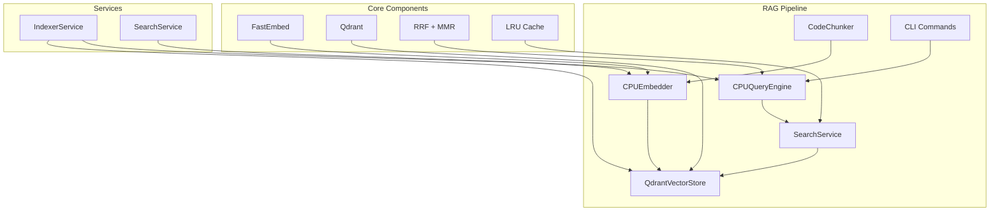

# 🤖 Python Анализатор Репозиториев с OpenAI GPT + RAG

Автоматический анализатор кода репозиториев с генерацией детальной Markdown документации через OpenAI GPT и семантическим поиском на основе RAG (Retrieval Augmented Generation). Создаёт подробные отчёты с анализом логики, компонентов, входов/выходов и обеспечивает интеллектуальный поиск по коду.

## ✨ Ключевые возможности

### Традиционный анализ кода
- 🔍 **Рекурсивное сканирование** репозиториев с поддержкой 9+ языков программирования
- 🧠 **ИИ-анализ кода** через OpenAI GPT с настраиваемыми промптами
- ⚡ **Батчевая обработка** - параллельный анализ файлов с адаптивной оптимизацией
- 📝 **Структурированные отчеты** с анализом логики, компонентов, входов/выходов
- 🗂️ **Сохранение структуры** - иерархия папок воссоздается в документации
- 🛡️ **Безопасная загрузка** файлов с валидацией и защитой от path traversal
- 💾 **Умное кэширование** результатов для экономии API вызовов
- 🌐 **Веб-интерфейс** на Streamlit и CLI с прогресс-барами
- 🔒 **Защита API ключей** - логирование только метаданных без конфиденциальной информации

### 🔬 RAG: Семантический поиск по коду
- 🚀 **FastEmbed эмбеддинги** - CPU-оптимизированные векторные представления кода
- 🔍 **Qdrant векторная БД** - быстрый поиск по семантическому сходству
- 🎯 **Продвинутые алгоритмы** - RRF, MMR для качественного ранжирования
- ⚡ **Гибридный поиск** - комбинация dense и sparse векторов
- 🗄️ **Кэширование** - LRU кэш с TTL для быстрых повторных запросов
- 👥 **Параллелизм** - до 20 одновременных пользователей

## 🆕 Что нового (ветка feature/next-gen)

- ⚡ Инкрементальный анализ: анализируются только изменённые файлы, ведётся индекс `./.repo_sum/index.json`.
- 🔒 Санитайзинг секретов: маскирование чувствительных данных по настраиваемым regex-паттернам перед отправкой в LLM.
- 🔁 Повторы вызовов OpenAI (retries): устойчивость к временным ошибкам API (настраивается в `settings.json`).
- 🧹 Точный фильтр библиотечных файлов: исключаются только явные вендорные/сборочные каталоги, меньше пропусков реального кода.
- 📁 Корректная директория вывода: генерация в `--output/ SUMMARY_REPORT_<repo>` (единое поведение CLI и веб).

## 🔍 RAG: Семантический поиск по коду

repo_sum теперь включает мощную RAG (Retrieval Augmented Generation) систему для семантического поиска по коду с использованием векторных эмбеддингов.

### 🎯 Возможности RAG системы:
- **🚀 FastEmbed эмбеддинги** - CPU-оптимизированные векторные представления кода через BAAI/bge-small-en-v1.5
- **🔍 Qdrant векторная БД** - быстрый поиск по семантическому сходству с поддержкой коллекций
- **🎯 Продвинутые алгоритмы** - RRF (Reciprocal Rank Fusion), MMR (Maximal Marginal Relevance) для качественного ранжирования
- **⚡ Гибридный поиск** - комбинация dense и sparse векторов для максимальной точности
- **🗄️ Интеллектуальное кэширование** - LRU кэш с TTL для быстрых повторных запросов
- **👥 Масштабируемость** - поддержка до 20 одновременных пользователей с connection pooling
- **📊 Детальная аналитика** - метрики поиска, производительности и качества результатов

### 🔬 Технические особенности:
- **CPU-оптимизация**: полностью работает без GPU, подходит для любого сервера
- **Батчевая обработка**: эффективная индексация больших репозиториев
- **Умные чанки**: автоматическое разбиение кода на семантически значимые блоки
- **Гибкие фильтры**: поиск по языкам, типам чанков, размерам файлов
- **Fault tolerance**: устойчивость к сбоям Qdrant и восстановление соединений

## 🛠 Поддерживаемые языки

- **Python** (.py) - полный AST анализ
- **JavaScript/TypeScript** (.js, .ts, .jsx, .tsx)  
- **Java** (.java)
- **C++** (.cpp, .cc, .cxx, .h, .hpp)
- **C#** (.cs)
- **Go** (.go)
- **Rust** (.rs)
- **PHP** (.php)
- **Ruby** (.rb)

## 📦 Установка и настройка

### 📋 Системные требования

**Для базового анализа:**
- Python 3.8+
- 2GB+ RAM

**Для RAG системы (дополнительно):**
- 4GB+ RAM (рекомендуется 8GB)
- Qdrant сервер (Docker или локальная установка)
- CPU с поддержкой AVX2 (для FastEmbed, опционально)

### 1. Клонирование и установка зависимостей

```bash
git clone <repository-url>
cd repo_sum
pip install -r requirements.txt
```

### 2. Настройка OpenAI API

1. Получите API ключ на [OpenAI Platform](https://platform.openai.com/api-keys)
2. Настройте переменную окружения:

```bash
# Linux/macOS
export OPENAI_API_KEY="sk-your-api-key-here"

# Windows
set OPENAI_API_KEY=sk-your-api-key-here
```

Или создайте файл `.env`:
```
OPENAI_API_KEY=sk-your-api-key-here
```

### 3. Установка Qdrant (для RAG системы)

#### 🐳 Docker (рекомендуется)
```bash
# Запуск Qdrant сервера
docker run -p 6333:6333 -p 6334:6334 \
  -v $(pwd)/qdrant_storage:/qdrant/storage:z \
  qdrant/qdrant
```

#### 🔧 Локальная установка
```bash
# Через cargo (требует Rust)
cargo install qdrant

# Или скачать бинарные файлы с GitHub
# https://github.com/qdrant/qdrant/releases
```

#### ☁️ Qdrant Cloud
Используйте [Qdrant Cloud](https://cloud.qdrant.io) для продакшена:
```bash
# Обновите settings.json с cloud endpoint:
# "qdrant": {
#   "host": "your-cluster.qdrant.io",
#   "port": 6333,
#   "api_key": "your-api-key"
# }
```

## 🚀 Использование

### Веб-интерфейс (рекомендуется)

```bash
python run_web.py
# или напрямую:
streamlit run web_ui.py
```

Откройте http://localhost:8501 в браузере:
1. 🔑 Введите API ключ в боковой панели
2. 📁 Выберите локальную папку или загрузите ZIP архив
3. 🚀 Нажмите "Начать анализ"
4. 📥 Скачайте готовую документацию

**Возможности веб-интерфейса:**
- ✅ Безопасная валидация загружаемых файлов (до 100MB)
- ✅ Предварительный просмотр статистики проекта
- ✅ Отслеживание прогресса батчевой обработки
- ✅ Защита от небезопасных архивов

### CLI команды

#### 📊 Традиционный анализ
```bash
# Анализ репозитория (инкрементальный)
python main.py analyze /path/to/repository -o ./documentation --incremental

# Статистика без анализа
python main.py stats /path/to/repository

# Управление кэшем
python main.py clear-cache
python main.py token-stats
```

#### 🔍 RAG команды (семантический поиск)

**Индексация репозитория:**
```bash
# Базовая индексация
python main.py rag index /path/to/repository

# Индексация с параметрами
python main.py rag index /path/to/repository --batch-size 1024 --recreate

# Обновление существующего индекса
python main.py rag index /path/to/repository --incremental
```

**Семантический поиск:**
```bash
# Простой поиск
python main.py rag search "authentication middleware"

# Поиск с фильтрами
python main.py rag search "database connection" --lang python --top-k 5 --chunk-type function

# Поиск по типу контента
python main.py rag search "error handling" --chunk-type class --min-score 0.8

# Расширенный поиск
python main.py rag search "async operations" --use-mmr --diversity-lambda 0.7
```

**Управление и статистика:**
```bash
# Статус RAG системы
python main.py rag status

# Детальная статистика
python main.py rag status --detailed

# Очистка индекса
python main.py rag clear --confirm
```

## ⚙️ Конфигурация

Настройки в файле `settings.json`:

```json
{
  "openai": {
    "max_tokens_per_chunk": 4000,
    "max_response_tokens": 5000,
    "temperature": 0.1,
    "retry_attempts": 3,
    "retry_delay": 1.0
  },
  "token_management": {
    "enable_caching": true,
    "cache_expiry_days": 7
  },
  "analysis": {
    "chunk_strategy": "logical",
    "min_chunk_size": 100,
    "languages_priority": ["python", "javascript", "java"],
    "enable_advanced_scoring": false,
    "sanitize_enabled": false,
    "sanitize_patterns": [
      "(?i)api_key\\s*[:=]\\s*['\"][^'\"]+['\"]",
      "(?i)password\\s*[:=]\\s*['\"][^'\"]+['\"]"
    ]
  },
  "file_scanner": {
    "max_file_size": 10485760,
    "excluded_directories": [".git", "node_modules", "__pycache__"],
    "supported_extensions": {
      ".py": "python",
      ".js": "javascript",
      ".ts": "typescript"
    }
  },
  "output": {
    "default_output_dir": "./docs",
    "file_template": "minimal_file.md",
    "index_template": "index_template.md",
    "format": "markdown",
    "templates_dir": "report_templates"
  },
  "prompts": {
    "code_analysis_prompt_file": "prompts/code_analysis_prompt.md"
  },
  "rag": {
    "embeddings": {
      "provider": "fastembed",
      "model_name": "BAAI/bge-small-en-v1.5",
      "batch_size_max": 128,
      "normalize_embeddings": true
    },
    "qdrant": {
      "host": "localhost",
      "port": 6333,
      "collection_name": "code_chunks",
      "vector_size": 384,
      "distance": "Cosine",
      "api_key": null
    },
    "search": {
      "max_results": 10,
      "min_score": 0.7,
      "use_hybrid": true,
      "mmr_enabled": true,
      "mmr_diversity_lambda": 0.5
    },
    "indexing": {
      "batch_size": 512,
      "max_concurrent": 4,
      "chunk_overlap": 50,
      "min_chunk_size": 100,
      "max_chunk_size": 2000
    },
    "cache": {
      "enabled": true,
      "max_size": 1000,
      "ttl_seconds": 3600
    }
  }
}
```

### 🔧 Параметры RAG конфигурации:

#### Эмбеддинги (`rag.embeddings`)
- `provider` — провайдер эмбеддингов (fastembed)
- `model_name` — модель для векторизации кода
- `batch_size_max` — максимальный размер батча для эмбеддингов
- `normalize_embeddings` — нормализация векторов

#### Qdrant (`rag.qdrant`)
- `host`/`port` — подключение к Qdrant серверу
- `collection_name` — имя коллекции для хранения векторов
- `vector_size` — размерность векторов (384 для bge-small)
- `distance` — метрика расстояния (Cosine/Dot/Euclidean)
- `api_key` — API ключ для Qdrant Cloud

#### Поиск (`rag.search`)
- `max_results` — максимальное количество результатов
- `min_score` — минимальный порог релевантности
- `use_hybrid` — использовать гибридный поиск
- `mmr_enabled` — включить MMR для диверсификации результатов
- `mmr_diversity_lambda` — баланс релевантность/разнообразие

#### Индексация (`rag.indexing`)
- `batch_size` — размер батча для индексации
- `max_concurrent` — максимальное количество параллельных задач
- `chunk_overlap` — перекрытие между чанками
- `min_chunk_size`/`max_chunk_size` — размеры чанков кода

### Ключевые параметры (коротко):
- `analysis.sanitize_enabled` — включить маскирование секретов перед отправкой в LLM.
- `analysis.sanitize_patterns` — список regex-паттернов для маскировки (см. пример выше).
- `openai.retry_attempts` / `openai.retry_delay` — повторы и задержка при ошибках API.
- `output.default_output_dir` — базовая директория вывода для CLI/веб.
- `output.format`/`output.templates_dir` — подготовка к HTML/PDF (пока формат — markdown).
- `analysis.chunk_strategy` — стратегия разбивки кода (logical/size/lines).
- `prompts.code_analysis_prompt_file` — путь к промпту.

## ⚡ Инкрементальный анализ

При включённом `--incremental` анализируются только изменённые файлы относительно индекса `./.repo_sum/index.json`.

- Как отключить: добавьте флаг `--no-incremental` в CLI.
- Как сбросить состояние: удалите `./.repo_sum/index.json` в корне анализируемого репозитория.

## 🔒 Санитайзинг секретов

Включите `analysis.sanitize_enabled` и задайте `analysis.sanitize_patterns`, чтобы маскировать чувствительные данные (например ключи/пароли) в коде перед отправкой в LLM. Это снижает риск утечки секретов.

## 🔁 Повторы вызовов OpenAI (retries)

Если API временно недоступен или исчерпана квота, выполняются повторы с задержкой:

- Настройка в `settings.json`: `openai.retry_attempts`, `openai.retry_delay`.
- При исчерпании всех попыток — ошибка фиксируется в отчёте файла.

## 📁 Путь вывода результатов

CLI/веб сохраняют отчёты в: `--output/ SUMMARY_REPORT_<repo_name>`. Главный индекс — `README.md` внутри этой папки.

## 📁 Структура вывода

```
SUMMARY_REPORT_<repo_name>/
├── README.md                           # Главный индексный файл
├── report_main.py.md                   # Файлы из корня
├── report_config.py.md
├── src/                                # Подкаталоги сохраняются
│   ├── report_src_app.py.md           # Файлы из подпапок
│   └── models/
│       └── report_src_models_user.py.md
└── tests/
    └── report_tests_test_main.py.md
```

### Формат отчёта для каждого файла:

```markdown
# Audit Report: filename.py

## 🔍 1. Краткий обзор (что делает файл?)
- **Назначение файла** — описание главной задачи
- **Последовательность операций** — пошаговый процесс

## ⚙️ 2. Подробности реализации (как работает?)
#### Входные данные
#### Обработка данных  
#### Выходные данные

## 🧩 3. Структура кода
Функции, методы и классы с описанием взаимосвязей

## 📌 4. Общий поток данных
Цепочка обработки от входа до выхода

## 🛑 5. Ограничения анализа
Что не включено в анализ и почему
```

## 🎨 Кастомизация промптов

Промпты хранятся в отдельных файлах для удобного редактирования:

1. **Редактирование текущего промпта:**
   ```bash
   nano prompts/code_analysis_prompt.md
   ```

2. **Создание собственного промпта:**
   ```bash
   # Создайте новый файл
   cp prompts/code_analysis_prompt.md prompts/my_prompt.md
   
   # Обновите конфигурацию
   # settings.json -> "prompts.code_analysis_prompt_file": "prompts/my_prompt.md"
   ```

3. **Перезапустите приложение** для применения изменений

## ⚡ Инкрементальный анализ

При включённом `--incremental` анализируются только изменённые файлы относительно индекса `./.repo_sum/index.json`. Индекс обновляется после успешной генерации отчётов.

## 🔒 Санитайзинг секретов

Включите `analysis.sanitize_enabled` и задайте `analysis.sanitize_patterns` (regex), чтобы маскировать чувствительные данные перед отправкой к LLM.

## 🌍 Развёртывание

### Локальная сеть
```bash
streamlit run web_ui.py --server.address 0.0.0.0 --server.port 8501
# Доступ: http://<your-ip>:8501
```

### Облачное развёртывание
1. Разверните на VPS (DigitalOcean, AWS, Yandex Cloud)
2. Установите зависимости и откройте порт 8501
3. Запустите с публичным доступом:
   ```bash
   streamlit run web_ui.py --server.address 0.0.0.0 --server.port 8501
   ```

### Автозапуск через systemd
```ini
[Unit]
Description=Repository Analyzer
After=network.target

[Service]
Type=simple
User=your-user
WorkingDirectory=/path/to/repo_sum
Environment=OPENAI_API_KEY=your-key
ExecStart=/usr/bin/python3 -m streamlit run web_ui.py --server.address 0.0.0.0
Restart=always

[Install]
WantedBy=multi-user.target
```

## 🔧 Производительность и оптимизация

### Батчевая обработка
- **Малые проекты** (≤10 файлов): батчи по 2 файла
- **Средние проекты** (11-50 файлов): батчи по 3 файла  
- **Большие проекты** (51-200 файлов): батчи по 5 файлов
- **Очень большие** (200+ файлов): батчи по 8 файлов

### Рекомендации по времени анализа:
- **Малые проекты** (< 50 файлов): 5-10 минут
- **Средние проекты** (50-200 файлов): 15-30 минут  
- **Большие проекты** (200+ файлов): 45+ минут

### Оптимизация для больших репозиториев:
1. Настройте `excluded_directories` для исключения ненужных папок
2. Уменьшите `max_file_size` для пропуска больших файлов
3. Используйте кэширование (`enable_caching: true`)
4. Периодически очищайте кэш: `python main.py clear-cache`

## 💰 Стоимость использования OpenAI API

### Примерные расходы (gpt-4o-mini):
- **Один файл**: ~$0.0001-0.0002
- **Малый проект** (20 файлов): ~$0.002-0.004
- **Средний проект** (100 файлов): ~$0.01-0.02
- **Большой проект** (500 файлов): ~$0.05-0.10

**Кэширование значительно снижает затраты при повторном анализе.**

## 🧪 Тестирование

### 🔍 RAG система
```bash
# Базовые компоненты RAG
pytest tests/test_rag_imports.py tests/test_vector_store_basic.py tests/test_cpu_query_engine.py -v

# Комплексные интеграционные тесты
pytest tests/rag/ -v

# Тесты производительности
pytest tests/rag/test_rag_performance.py -v

# End-to-end тесты CLI
pytest tests/rag/test_rag_e2e_cli.py -v

# Все RAG тесты
python tests/rag/run_rag_tests.py all

# Быстрая проверка RAG
python tests/rag/run_rag_tests.py quick
```

### 📊 Традиционные функции
```bash
# Все существующие тесты
pytest tests/test_*.py -v

# Интеграционные тесты
pytest tests/e2e/ -v

# Тесты с покрытием
pytest --cov=. tests/ --cov-report=html
```

### 🎯 Специфичные тесты
```bash
# Тесты парсеров
pytest tests/test_parsers.py -v

# Тесты веб-интерфейса
pytest tests/test_web_ui.py -v

# Тесты OpenAI интеграции
pytest tests/test_openai_integration.py -v
```

## 🐛 Устранение проблем

### Частые ошибки (традиционные)

**Ошибка аутентификации OpenAI:**
```
Проверьте правильность API ключа в переменной OPENAI_API_KEY
```

**"Файл слишком большой" (>100MB):**
```
Используйте файлы меньшего размера или увеличьте MAX_FILE_SIZE в web_ui.py
```

**"Файл промпта не найден":**
```
Убедитесь что prompts/code_analysis_prompt.md существует
Проверьте путь в settings.json
```

**Файлы не найдены для анализа:**
```
Проверьте supported_extensions в settings.json
Убедитесь что папки не исключены в excluded_directories
```

### 🔍 Проблемы RAG системы

**RAG система недоступна:**
```
Убедитесь что Qdrant сервер запущен на localhost:6333
Проверьте настройки rag.qdrant в settings.json
Проверьте доступность: curl http://localhost:6333/collections
```

**Ошибки индексации:**
```
Проверьте доступное место на диске для Qdrant
Уменьшите rag.indexing.batch_size при нехватке RAM
Убедитесь что Qdrant сервер не перегружен
```

**Низкая точность поиска:**
```
Попробуйте другую модель эмбеддингов в rag.embeddings.model_name
Увеличьте количество результатов (rag.search.max_results)
Настройте параметры MMR (rag.search.mmr_diversity_lambda)
Уменьшите rag.search.min_score для большего охвата
```

**Медленная индексация:**
```
Уменьшите rag.indexing.batch_size
Увеличьте rag.indexing.max_concurrent (осторожно с RAM)
Проверьте производительность Qdrant сервера
Используйте SSD для хранения Qdrant данных
```

**Ошибки FastEmbed:**
```
Установите модель заново: pip install --upgrade fastembed
Проверьте поддержку AVX2: python -c "import platform; print(platform.processor())"
Попробуйте меньший batch_size_max в rag.embeddings
```

### Логи и отладка

```bash
# Подробные логи
python main.py -v analyze /path/to/repo

# Только ошибки
python main.py -q analyze /path/to/repo

# Логи в файл
python main.py analyze /path/to/repo 2> debug.log

# RAG отладка
python main.py rag search "test query" --verbose
python main.py rag status --detailed
python main.py rag index /path/to/repo --verbose
```

## 🏗 Архитектура проекта

```
repo_sum/
├── main.py                 # CLI интерфейс и RepositoryAnalyzer
├── web_ui.py              # Streamlit веб-интерфейс
├── config.py              # Система конфигурации
├── file_scanner.py        # Сканирование файлов репозитория
├── openai_integration.py  # Интеграция с OpenAI API
├── doc_generator.py       # Генерация MD документации
├── code_chunker.py        # Разбивка кода на логические части
├── utils.py               # Утилиты и структуры данных
├── rag/                   # 🆕 RAG система
│   ├── __init__.py        # Публичные интерфейсы RAG
│   ├── embedder.py        # CPUEmbedder (FastEmbed)
│   ├── vector_store.py    # QdrantVectorStore
│   ├── query_engine.py    # CPUQueryEngine
│   ├── indexer_service.py # IndexerService
│   ├── search_service.py  # SearchService
│   └── exceptions.py      # RAG исключения
├── parsers/               # Парсеры для разных языков
│   ├── base_parser.py     # Базовый класс парсера
│   ├── python_parser.py   # Python AST парсер
│   └── [language]_parser.py
├── prompts/               # Внешние промпты для анализа
│   └── code_analysis_prompt.md
├── settings.json          # Конфигурация приложения
├── requirements.txt       # Python зависимости
└── tests/                 # Тесты
    ├── test_*.py          # Основные тесты
    └── rag/               # 🆕 RAG тесты
        ├── test_rag_integration.py
        ├── test_rag_performance.py
        ├── test_rag_e2e_cli.py
        └── run_rag_tests.py
```

### 🏗️ Архитектура RAG системы



### Ключевые компоненты:

#### Традиционные компоненты:
- **RepositoryAnalyzer** - основной класс координации анализа
- **FileScanner** - поиск и фильтрация файлов
- **ParserRegistry** - выбор парсера по типу файла
- **CodeChunker** - интеллектуальная разбивка кода
- **OpenAIManager** - работа с API, кэширование, retry-логика
- **DocumentationGenerator** - создание финальных MD отчетов

#### 🆕 RAG компоненты:
- **CPUEmbedder** - генерация векторных представлений через FastEmbed
- **QdrantVectorStore** - управление векторной базой данных
- **CPUQueryEngine** - движок семантического поиска с RRF и MMR
- **IndexerService** - сервис индексации репозиториев
- **SearchService** - высокоуровневый поисковый интерфейс
- **RAGExceptions** - специализированные исключения для RAG

## 📄 Лицензия

MIT License - подробности в файле LICENSE.

## 🤝 Разработка и вклад

1. Форкните репозиторий
2. Создайте feature-ветку (`git checkout -b feature/new-feature`)
3. Внесите изменения и добавьте тесты
4. Создайте коммит (`git commit -m 'Add new feature'`)
5. Отправьте в ветку (`git push origin feature/new-feature`)
6. Создайте Pull Request

## 📧 Поддержка

При возникновении проблем:
- Создайте Issue в GitHub с подробным описанием
- Приложите логи с флагом `-v` (verbose mode)
- Укажите версию Python и операционную систему
- Приложите содержимое `settings.json` (без API ключа)

---

**Создано для автоматизации документирования кода с ❤️ и ИИ**