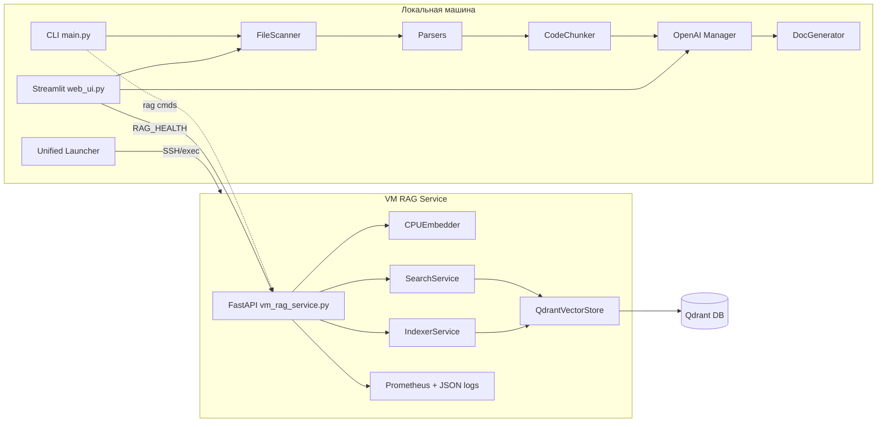
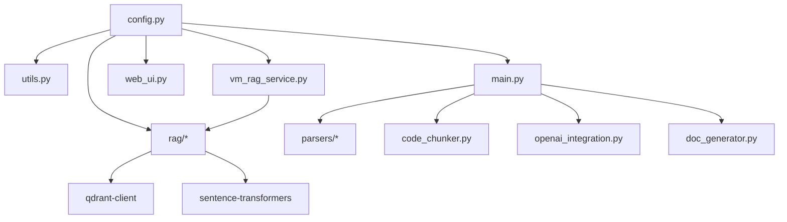
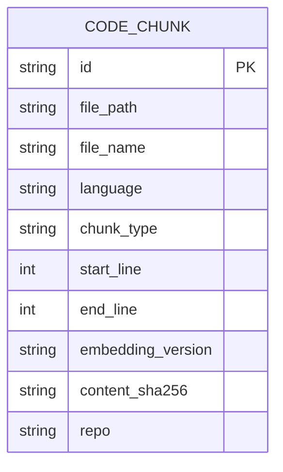
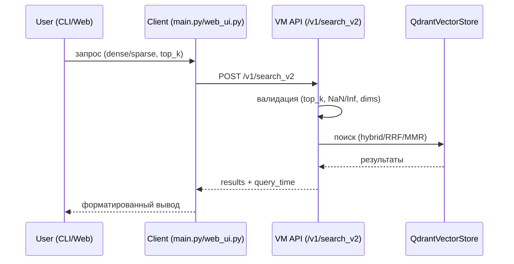

# Оглавление

- [1. Аннотация и границы проекта](#1-аннотация-и-границы-проекта)
- [2. Архитектура и компоненты](#2-архитектура-и-компоненты)
- [3. Данные и схемы](#3-данные-и-схемы)
- [4. API и интеграции](#4-api-и-интеграции)
- [5. Конфиги и окружения](#5-конфиги-и-окружения)
- [6. Инфраструктура, CI/CD, наблюдаемость](#6-инфраструктура-cicd-наблюдаемость)
- [7. Безопасность (модель угроз, секреты, лицензии)](#7-безопасность-модель-угроз-секреты-лицензии)
- [8. Тестирование и качество](#8-тестирование-и-качество)
- [9. Функциональные сценарии и UX-флоу](#9-функциональные-сценарии-и-ux-флоу)
- [10. Эксплуатация и трблшутинг](#10-эксплуатация-и-трблшутинг)
- [11. Матрица покрытия репозитория](#11-матрица-покрытия-репозитория)
- [12. Риски, техдолг, неопределенности](#12-риски-техдолг-неопределенности)
- [13. Дорожная карта и рекомендации](#13-дорожная-карта-и-рекомендации)
- [14. Глоссарий и сокращения](#14-глоссарий-и-сокращения)
- [15. Приложения](#15-приложения)
- [Контрольный чек-лист полноты](#контрольный-чек-лист-полноты)


## Входные данные (фиксация)

- ROOT: d:\Scripts_Python\repo_sum
- ТЕХСТЕК: Python 3; FastAPI (VM сервис), Streamlit (Web UI), Click/Rich (CLI), Pydantic v1/v2 совместимость, Prometheus client, Qdrant (векторное хранилище), Sentence Transformers/Jina v3, FAISS/fastembed (CPU), OpenAI SDK, pytest/pytest-asyncio/Hypothesis
- ДОМЕН: RAG-as-a-Service для анализа исходного кода репозиториев, индексирования «логических» фрагментов и поиска по ним (dense/sparse/hybrid) с локальным CLI/Web-UI и удаленным VM‑сервисом
- ИСКЛЮЧЕНИЯ (опц.): __pycache__/**, *.pyc, .hypothesis/**, .coverage, logs/**, *.log, cache/**, SUMMARY_REPORT_*/**, docs/**.pdf
- TARGET_DOC: docs/PROJECT_FULL_SPEC.md


## 1. Аннотация и границы проекта

- Назначение: платформа анализа репозиториев и генерации технической документации на основе LLM, с поддержкой полнотекстового и векторного поиска по кодовым «кускам» (chunks).
- Границы: один репозиторий; индексирование в Qdrant (1024d, Jina v3); удаленный VM‑сервис предоставляет REST API; локальные интерфейсы — CLI и Web UI; унифицированный лаунчер автоматизирует «setup→start→monitor».
- Важные ограничения:
  - CPU-first: без требования GPU; OOM‑защита на VM (gc + HTTP 507 при >~92% RAM).
  - Offline‑режимы тестов: без внешней сети, моки эмбеддеров/клиентов.
  - Fail‑fast ключей: CLI требует корректный `OPENAI_API_KEY` (префикс `sk-`) вне offline.
- Целевые пользователи: разработчики/архитекторы, техписатели, CI‑агенты.


## 2. Архитектура и компоненты

### 2.1 Обзор компонентов

- CLI (`main.py`): анализ репозитория, генерация MD‑отчетов, подкоманды `rag index|search|status`, `token_stats`, `clear_cache`.
- Web UI (`run_web.py`, `web_ui.py`): Streamlit интерфейс, headless; автопроверка удаленных сервисов; порт‑чек.
- VM RAG Service (`vm_rag_service.py`): FastAPI, эндпоинты `/v1/health`, `/v1/embeddings`, `/v1/search_v2`, `/v1/index`, `/metrics`; прометей‑метрики; middleware памяти.
- RAG ядро (`rag/*`): фабрика, эмбеддер (CPU/remote), вектор‑хранилище (Qdrant), поисковый слой, индексатор, retry/circuit.
- Конфиг и утилиты (`config.py`, `utils.py`), парсеры (`parsers/*`), чанкер (`code_chunker.py`), генератор MD (`doc_generator.py`).
- Оркестрация VM/локала (`unified_launcher.py`), автоматизация VM (`vm_start.py`).

### 2.2 Диаграмма компонентов (Mermaid)



### 2.3 Границы контекстов и зависимости

- Внешние зависимости: OpenAI API (анализ), Qdrant (векторы), Streamlit (UI), Prometheus (метрики).
- Внутренние зависимости: `config.py` агрегирует env/JSON‑конфиги; RAG‑фабрика выбирает Local/Remote реализации; CLI лениво импортирует RAG‑модули (не поднимать кверху — см. lazy import).
- Точки расширения: добавление парсеров (`parsers/*`), альтернативных эмбеддеров/вектор‑сторов (через `RAGFactory`), стратегий чанкования (`code_chunker.py`).

### 2.4 Граф зависимостей (высокий уровень)




## 3. Данные и схемы

- Персистентное хранилище: Qdrant коллекция `code_chunks` (размерность 1024, cosine). Поля payload включают путь файла, имя, язык, тип чанка, линии, версию эмбеддинга, SHA256 контента.
- Миграции: отсутствуют в репозитории; создание/инициализация коллекции выполняется программно (`rag/vector_store.py`).
- Резервирование/ретенция: не зафиксированы в коде; рекомендуется управлять snapshot’ами Qdrant отдельно.

### 3.1 ER‑диаграмма (концептуальная)




## 4. API и интеграции

### 4.1 REST API (VM)

- Метрики: `GET /metrics` (Prometheus)
- Служебные: `GET /` (root), `GET /v1/health` — статус сервисов (embedder, vector_store)
- Эмбеддинги: `POST /v1/embeddings` — батч текстов; dual‑task, нормализация, truncate‑dim
- Поиск:
  - `POST /v1/search_v2` — протокол векторов (dense/sparse), обязательна проверка размерности и NaN/Inf запрет (`vm_rag_service.py:607`)
  - `POST /v1/search` — legacy text query (`vm_rag_service.py:598`)
- Индексирование: `POST /v1/index` — `X-API-Contract: v1.0.0` обязателен; batch 1..128; строгая SHA256 (опционально через `RAG_ENFORCE_SHA256`) (`vm_rag_service.py:906`, `vm_rag_service.py:913`, `vm_rag_service.py:992`)

Пример валидации (выдержка):

```python
# vm_rag_service.py:996
if (doc.content_sha256 or "").lower() != computed.lower():
    preflight_rejected[doc_id] = {"reason": "sha256_mismatch", ...}
```

### 4.2 CLI

- `analyze <repo> [--output ./docs] [--incremental/--no-incremental]` (`main.py:455`)
- `stats <repo>` — обзор статистики кода (`main.py:506`)
- `token_stats` — статистика расхода токенов (`main.py:521`)
- `clear_cache` — очистка кэша OpenAI (`main.py:500`)
- `rag index|search|status` — операции RAG (см. `main.py:568`, `main.py:691`, `main.py:823`)

### 4.3 Web UI

- Headless Streamlit; автопроверка удаленных сервисов через `RAG_HEALTH_ENDPOINT`; жесткая проверка занятости порта (`run_web.py:150`).

### 4.4 Интеграции

- OpenAI: чат‑комплишны для анализа кода; оффлайн‑транспорт для тестов (`openai_integration.py`).
- Qdrant: HTTP/gRPC клиенты, health‑check, создание коллекций, поиск/индексация (`rag/vector_store.py`).


## 5. Конфиги и окружения

### 5.1 Файлы конфигурации

- `settings.json`, `settings-test.json` — основные параметры (embeddings, vector_store, query_engine, timeout_profiles).
- `pytest.ini` — маркеры, asyncio strict, подавление известного предупреждения.
- `.ruff.toml` — только lint (без `ruff format`), глобальные игноры E402/E722/E731/F401/F841; исключены `legacy/**`, `tests/bench/**`.
- `.github/workflows/ci.yml` — CI (pytest, lint) — см. раздел 6.
- `.env.example` — пример окружения (секреты заменять шаблонами при использовании).

### 5.2 Переменные окружения (основные)

- OpenAI: `OPENAI_API_KEY=<REDUCTED>`, `OPENAI_MODEL`, `OPENAI_TEMPERATURE`, `OPENAI_RETRY_ATTEMPTS`, `OPENAI_RETRY_DELAY`, `FORCE_OPENAI_ONLINE_FOR_TESTS` — используются в `config.py` и `openai_integration.py`.
- Offline/тесты: `OFFLINE_MODE=1`, `USE_MOCK_EMBEDDER=1`, `USE_MOCK_OPENAI=1`, `HF_HUB_OFFLINE=1`, `TRANSFORMERS_OFFLINE=1` — (`main.py`, `openai_integration.py`).
- VM/Remote: `VM_HOST`, `VM_USER`, `VM_PASSWORD=<REDUCTED>`, `VM_PORT`, `VM_REPO_URL`, `VM_REPO_BRANCH`, `RAG_SERVICE_HOST`, `RAG_SERVICE_PORT`, `RAG_HEALTH_ENDPOINT` — (`vm_start.py`, `run_web.py`).
- Qdrant: `QDRANT_HOST`, `QDRANT_PORT`, `QDRANT_PREFER_GRPC`, `QDRANT_COLLECTION_NAME`, `QDRANT_DISTANCE`, `QDRANT_*` HNSW/quantization — (`config.py`, `rag/vector_store.py`).
- Embeddings: `EMB_MODEL_ID`, `EMB_DIM`, `EMB_TRUNCATE_DIM`, `EMB_TASK_QUERY`, `EMB_TASK_PASSAGE`, `EMB_L2_NORMALIZE`, `EMB_TRUST_REMOTE_CODE` — (`config.py`).
- Поиск/кэш: `SEARCH_*`, `CACHE_*` — (`config.py`).
- Параллелизм: `TORCH_NUM_THREADS`, `OMP_NUM_THREADS`, `MKL_NUM_THREADS` — (`config.py`, VM профили).
- Web UI: `PORT`, `STREAMLIT_BROWSER_GATHER_USAGE_STATS=false`, `STREAMLIT_SERVER_HEADLESS=true` — (`run_web.py`).
- Индекс‑строгий SHA: `RAG_ENFORCE_SHA256=true` — (`vm_rag_service.py`).

Матрица окружений: dev — `settings.json`; test — `settings-test.json` + OFFLINE; stage/prod — через .env на VM и переменные среды (см. `vm_start.py`).


## 6. Инфраструктура, CI/CD, наблюдаемость

- Docker/K8s/IaC: отсутствуют в репозитории (VM‑скрипты bash/ps1 для автомата установки).
- CI/CD: `.github/workflows/ci.yml` — запуск lint/pytest; артефакты не сохраняются.
- Unified Launcher: `unified_launcher.py` — единый сценарий `setup → start → monitor` (см. `unified_launcher.py:70`, `:174`).
- VM‑автоматизация: SSH‑setup, ветка из GitHub API, health‑проверки, фоновые службы c PID (`vm_start.py`).
- Наблюдаемость VM‑сервиса: Prometheus (`/metrics`), JSON‑логи (нормализация путей /v1/*), gauges/histograms (`vm_rag_service.py:374`, `:380`, `:385`, `:390`, `:395`, `:401`).
- Память: при критической загрузке — GC + HTTP 507 (`vm_rag_service.py:220` и `:245`).


## 7. Безопасность (модель угроз, секреты, лицензии)

- STRIDE кратко:
  - Spoofing: доступ к VM API — требуется сетевой периметр (нет явной аутентификации в коде).
  - Tampering: запрет NaN/Inf, проверка размерности векторов; опциональный строгий SHA256.
  - Repudiation: структурированные логи с trace_id/batch_id в middleware.
  - Information Disclosure: маскирование секретов при анализе (sanitize), отсутствие утечек ключей в отчетах.
  - DoS: лимит памяти и 507; таймауты/ретраи; batch‑лимиты 1..128.
  - Elevation: отсутствует RBAC/ABAC; требуется внешняя аутентификация/ограничение сети.
- Секрет‑менеджмент: .env (локально), env‑переменные на VM. Все секреты в документации заменять `<REDUCTED>`.
- Зависимости: смотреть `requirements.txt` (конфликт по `rich` >=14 и >=13 — риск резолвера). Рекомендуется зафиксировать версии и запускать SCA (pip‑audit, osv‑scanner).
- CORS/ACL/Rate limiting: не реализованы в коде; рекомендовано добавить FastAPI middleware и reverse‑proxy лимитирование.


## 8. Тестирование и качество

- Фреймворк: pytest (+ asyncio strict, Hypothesis). Маркеры: `asyncio`, `integration`, `functional`, `smoke`, `e2e`, `property`, `rag`, `slow`, `stress`, `benchmark`, `mock`, `real`, `enable_socket`, `real_embedder`, `mock_embedder`, `vm`.
- Покрытие видов: unit (utils, parsers, chunker), integration (rag, vector store), e2e (CLI анализ, Web UI), benchmarks (tests/bench).
- Известные подавления: см. `pytest.ini` (suppress PytestUnhandledThreadExceptionWarning).
- Стиль: Ruff только lint (без автоформатирования).


## 9. Функциональные сценарии и UX‑флоу

Основные use‑cases:

1) Анализ репозитория и генерация MD‑документации (CLI):
   - Ввод: путь к репозиторию; опции `--output`, `--incremental`.
   - Вывод: `SUMMARY_REPORT_<repo>` с отчётами по файлам.

2) Индексирование репозитория в Qdrant (CLI → VM API):
   - Разбиение на чанки, расчёт эмбеддингов, запись в коллекцию.

3) Поиск по коду (CLI/Web → VM API):
   - Протокол `/v1/search_v2` (вектора), гибридный поиск.

### 9.1 Диаграмма последовательностей: Search_v2




## 10. Эксплуатация и трблшутинг

- Локально: `python main.py analyze <repo>`; Web UI — `python run_web.py` (порт по `PORT` или 8501).
- VM: `python vm_start.py start|status|stop|update|diagnose` — автоматизация установки/перезапуска; проверка `/health`.
- Unified Launcher: `python unified_launcher.py all` — последовательно setup VM и старт Web UI.
- Типовые инциденты:
  - Порт занят — жесткий отказ запуска (`run_web.py:150`).
  - Высокая память — GC и 507 (повторить позже, уменьшить batch).
  - Ошибка Qdrant — проверка `vector_store.health_check()`, см. диагностические рекомендации в CLI `rag status`.


## 11. Матрица покрытия репозитория (Файл → Раздел)

Принцип: каждый файл сопоставлен одному основному разделу документа.

| Файл | Раздел |
|---|---|
| .claude/CLAUDE.md | 6. Инфраструктура, CI/CD, наблюдаемость |
| .claude/output-styles/DEV.md | 15. Приложения |
| .claude/settings.local.json | 5. Конфиги и окружения |
| .env.example | 5. Конфиги и окружения |
| .github/workflows/ci.yml | 6. Инфраструктура, CI/CD, наблюдаемость |
| .gitignore | 5. Конфиги и окружения |
| .repo_sum/index.json | 3. Данные и схемы |
| .roo/rules-code/AGENTS.md | 15. Приложения |
| .roo/rules-debug/AGENTS.md | 15. Приложения |
| .ruff.toml | 8. Тестирование и качество |
| AGENTS.md | 6. Инфраструктура, CI/CD, наблюдаемость |
| README.md | 15. Приложения |
| VM_SERVICE_CLI.md | 15. Приложения |
| code_chunker.py | 2. Архитектура и компоненты |
| collect_vm_metrics.py | 6. Инфраструктура, CI/CD, наблюдаемость |
| config.py | 5. Конфиги и окружения |
| doc_generator.py | 2. Архитектура и компоненты |
| docs/FACTORY_PATTERN_DEPLOYMENT_GUIDE.md | 15. Приложения |
| docs/RECURSION_FIX_FACTORY_PATTERN_SPEC.md | 15. Приложения |
| docs/SLA_SLO.md | 6. Инфраструктура, CI/CD, наблюдаемость |
| docs/VM_STARTUP_CONFIGURATION.md | 6. Инфраструктура, CI/CD, наблюдаемость |
| docs/VM_START_COMPREHENSIVE_GUIDE.md | 6. Инфраструктура, CI/CD, наблюдаемость |
| docs/api/openapi.yaml | 4. API и интеграции |
| docs/oom_reports/2025-10-02_baseline.md | 6. Инфраструктура, CI/CD, наблюдаемость |
| docs/oom_reports/2025-10-03_comprehensive_analysis.md | 6. Инфраструктура, CI/CD, наблюдаемость |
| docs/oom_reports/2025-10-03_quick_test_phases_2-4.md | 6. Инфраструктура, CI/CD, наблюдаемость |
| docs/Анализ проекта.md | 15. Приложения |
| docs/Глубокий анализ проекта __repo_sum__.pdf | 15. Приложения |
| file_scanner.py | 2. Архитектура и компоненты |
| legacy/backups/config.py.backup | 12. Риски/Техдолг/Неопределенности |
| legacy/backups/migration_backup_20251003_112326/.env.example | 5. Конфиги и окружения |
| legacy/backups/migration_backup_20251003_112326/migration_settings.json | 5. Конфиги и окружения |
| legacy/backups/migration_backup_20251003_112326/rollback_migration.sh | 6. Инфраструктура, CI/CD, наблюдаемость |
| legacy/backups/migration_backup_20251003_112326/settings.json | 5. Конфиги и окружения |
| legacy/backups/vm_rag_service.py.backup | 12. Риски/Техдолг/Неопределенности |
| legacy/backups/vm_start.py.backup | 12. Риски/Техдолг/Неопределенности |
| legacy/scripts_backups/backups/code_chunks_metadata_20250915_123217.json | 3. Данные и схемы |
| legacy/scripts_backups/backups/repo_sum_jina_v3_metadata_20250915_123246.json | 3. Данные и схемы |
| legacy/tests_backups/conftest.py.backup | 12. Риски/Техдолг/Неопределенности |
| main.py | 2. Архитектура и компоненты |
| openai_integration.py | 2. Архитектура и компоненты |
| parsers/__init__.py | 2. Архитектура и компоненты |
| parsers/base_parser.py | 2. Архитектура и компоненты |
| parsers/cpp_parser.py | 2. Архитектура и компоненты |
| parsers/csharp_parser.py | 2. Архитектура и компоненты |
| parsers/javascript_parser.py | 2. Архитектура и компоненты |
| parsers/python_parser.py | 2. Архитектура и компоненты |
| parsers/typescript_parser.py | 2. Архитектура и компоненты |
| prompts/code_analysis_prompt.md | 15. Приложения |
| pytest.ini | 8. Тестирование и качество |
| rag/__init__.py | 2. Архитектура и компоненты |
| rag/circuit_breaker.py | 2. Архитектура и компоненты |
| rag/context.py | 2. Архитектура и компоненты |
| rag/embedder.py | 2. Архитектура и компоненты |
| rag/embedder_protocol.py | 2. Архитектура и компоненты |
| rag/event_loop_manager.py | 2. Архитектура и компоненты |
| rag/exceptions.py | 2. Архитектура и компоненты |
| rag/factory.py | 2. Архитектура и компоненты |
| rag/indexer_service.py | 2. Архитектура и компоненты |
| rag/memory_vector_store.py | 2. Архитектура и компоненты |
| rag/query_engine.py | 2. Архитектура и компоненты |
| rag/remote_embedder.py | 2. Архитектура и компоненты |
| rag/remote_vector_store.py | 2. Архитектура и компоненты |
| rag/retry_policy.py | 2. Архитектура и компоненты |
| rag/search_service.py | 2. Архитектура и компоненты |
| rag/sparse_encoder.py | 2. Архитектура и компоненты |
| rag/transport_client.py | 2. Архитектура и компоненты |
| rag/vector_store.py | 2. Архитектура и компоненты |
| rag/vm_diagnostics.py | 6. Инфраструктура, CI/CD, наблюдаемость |
| requirements.txt | 5. Конфиги и окружения |
| rules/AGENTS.md | 15. Приложения |
| rules/Development Roadmap.md | 13. Дорожная карта и рекомендации |
| rules/Project Overview.md | 1. Аннотация и границы проекта |
| rules/RAG_TIMEOUT_FIX_COMPREHENSIVE_PLAN.md | 6. Инфраструктура, CI/CD, наблюдаемость |
| rules/RECURSION_FIX_2025_10_07.md | 6. Инфраструктура, CI/CD, наблюдаемость |
| rules/Technical Architecture.md | 2. Архитектура и компоненты |
| rules/Technical Debt.md | 12. Риски/Техдолг/Неопределенности |
| rules/all_refactor.md | 12. Риски/Техдолг/Неопределенности |
| rules/rerfactor_oom.md | 12. Риски/Техдолг/Неопределенности |
| run_web.py | 6. Инфраструктура, CI/CD, наблюдаемость |
| scripts/PHASE2_DEPLOYMENT_GUIDE.md | 6. Инфраструктура, CI/CD, наблюдаемость |
| scripts/backup_env_settings.py | 6. Инфраструктура, CI/CD, наблюдаемость |
| scripts/check_timeouts.ps1 | 6. Инфраструктура, CI/CD, наблюдаемость |
| scripts/check_timeouts.py | 6. Инфраструктура, CI/CD, наблюдаемость |
| scripts/check_timeouts_vm.sh | 6. Инфраструктура, CI/CD, наблюдаемость |
| scripts/clean_pycache.py | 6. Инфраструктура, CI/CD, наблюдаемость |
| scripts/cleanup_old_collections.py | 6. Инфраструктура, CI/CD, наблюдаемость |
| scripts/database_migration_jina_v3.py | 6. Инфраструктура, CI/CD, наблюдаемость |
| scripts/migrate_to_jina_v3.py | 6. Инфраструктура, CI/CD, наблюдаемость |
| scripts/validate_vm_env.py | 6. Инфраструктура, CI/CD, наблюдаемость |
| scripts/verify_requirements.py | 8. Тестирование и качество |
| scripts/verify_search_endpoint_smoke.py | 4. API и интеграции |
| scripts/vm_diagnostics_phase2.py | 6. Инфраструктура, CI/CD, наблюдаемость |
| scripts/vm_phase2_setup.sh | 6. Инфраструктура, CI/CD, наблюдаемость |
| scripts/vm_rag_service_phase2.patch | 12. Риски/Техдолг/Неопределенности |
| scripts/vm_setup_phase1.py | 6. Инфраструктура, CI/CD, наблюдаемость |
| settings-test.json | 5. Конфиги и окружения |
| settings.json | 5. Конфиги и окружения |
| temp_add_env_var.py | 6. Инфраструктура, CI/CD, наблюдаемость |
| temp_restart_service.py | 6. Инфраструктура, CI/CD, наблюдаемость |
| test_async_sync_fix.py | 8. Тестирование и качество |
| test_bugfixes_validation.py | 8. Тестирование и качество |
| test_chunker_diagnosis.py | 8. Тестирование и качество |
| test_fixes_simple.py | 8. Тестирование и качество |
| tests/** | 8. Тестирование и качество |
| unified_launcher.py | 6. Инфраструктура, CI/CD, наблюдаемость |
| utils.py | 2. Архитектура и компоненты |
| vm_rag_service.py | 4. API и интеграции |
| vm_start.py | 6. Инфраструктура, CI/CD, наблюдаемость |
| web_ui.py | 4. API и интеграции |


## 12. Риски, техдолг, неопределенности

- Конфликт версий `rich` в `requirements.txt` (>=14 и >=13) — риск нестабильного резолва. Рекомендация: зафиксировать единый диапазон и запустить `pip-compile`.
- Отсутствие явной аутентификации/авторизации у VM API — рекомендуется добавить API‑ключ/JWT и CORS/ACL.
- Нет контейнеризации (Docker/K8s) — усложняет воспроизводимость; текущие VM‑скрипты покрывают установку, но нет декларативной IaC.
- Потенциальные проблемы кодировки (много кириллических строк; в README наблюдалась mojibake) — уже есть принудительный UTF‑8 для Windows stdout/stderr (`main.py`).
- Отсутствие формализованного управления схемами данных (миграции Qdrant) — логика развертывания внутри `rag/vector_store.py`.
- Производительность: при больших батчах индексирование чувствительно к памяти (введены GC/507 и параметры HNSW); рекомендуется профилировать.

Неопределенности:
- Лицензирование зависимостей и самого проекта — отсутствует LICENSE; требуется определение.
- Политики бэкапов Qdrant — вне кода проекта.


## 13. Дорожная карта и рекомендации

Быстрые выигрыши:
- Зафиксировать конфликт `rich` и добавить `pip-audit` в CI.
- Включить простую аутентификацию для VM API (API‑ключ в заголовке) и CORS.
- Добавить Dockerfile и Compose для локального запуска (Qdrant + сервис).

Приоритетные инициативы:
- Observability: дашборды Prometheus/Grafana; расширить метрики (нагрузка embedder/search, коды ошибок).
- Безопасность: rate limiting, ingress‑ACL, секрет‑хранилище, TLS‑терминация на proxy.
- DX: генерация OpenAPI клиента; автогенерация SDK для CLI.

KPI/метрики результата:
- Время индексации N файлов (p95) и объем RAM.
- Время ответа `/v1/search_v2` (p95), QPS при X одновременных пользователях.
- Покрытие тестами критичных модулей (>80% по строкам rag/*).


## 14. Глоссарий и сокращения

- RAG — Retrieval‑Augmented Generation.
- Qdrant — векторное хранилище с HNSW‑индексами.
- HNSW — Hierarchical Navigable Small World (ANN индекс).
- MMR — Maximal Marginal Relevance.
- RRF — Reciprocal Rank Fusion.
- VM — виртуальная машина (удаленный сервис).


## 15. Приложения

### 15.1 Пример запроса `/v1/search_v2`

```json
{
  "dense_vector": [0.01, 0.02, ...],
  "sparse_vector": {"12": 0.5, "98": 0.2},
  "top_k": 10,
  "use_hybrid": true,
  "filters": {"language": "python"},
  "task": "retrieval.query"
}
```

### 15.2 Переменные окружения (редактированный пример .env)

```
OPENAI_API_KEY=<REDUCTED>
VM_HOST=<REDUCTED>
VM_USER=<REDUCTED>
VM_PASSWORD=<REDUCTED>
QDRANT_HOST=localhost
QDRANT_PORT=6333
RAG_SERVICE_PORT=8000
RAG_HEALTH_ENDPOINT=/v1/health
```

### 15.3 Кодовые выдержки (ссылки на исходники)

- Нормализация endpoint’ов и метрики: `vm_rag_service.py:402`

```python
# vm_rag_service.py:374
request_duration_seconds = Histogram('rag_request_duration_seconds', 'Request duration seconds', ['endpoint','status'])
```

- Команда CLI индексации: `main.py:568`

```python
@rag.command()
def index(repo_path, batch_size, recreate, no_progress):
    from rag.indexer_service import IndexerService
```

- Проверка ключа OpenAI (fail‑fast): `main.py:379`

```python
api_key = os.getenv("OPENAI_API_KEY", "")
if not api_key or not api_key.startswith("sk-"):
    sys.exit(1)
```


## Контрольный чек-лист полноты

- [x] 1. Аннотация и границы проекта
- [x] 2. Архитектура и компоненты (+диаграммы)
- [x] 3. Данные и схемы (+ER)
- [x] 4. API и интеграции (+таблицы/спеки)
- [x] 5. Конфиги и окружения
- [x] 6. Инфраструктура, CI/CD, наблюдаемость
- [x] 7. Безопасность (модель угроз, секреты, лицензии)
- [x] 8. Тестирование и качество
- [x] 9. Функциональные сценарии и UX‑флоу (+sequence)
- [x] 10. Эксплуатация и трблшутинг
- [x] 11. Матрица покрытия репозитория (Файл → Раздел)
- [x] 12. Риски/Техдолг/Неопределенности
- [x] 13. Дорожная карта и рекомендации
- [x] 14. Глоссарий и сокращения
- [x] 15. Приложения (спеки, примеры конфигов с безопасной редакцией)
