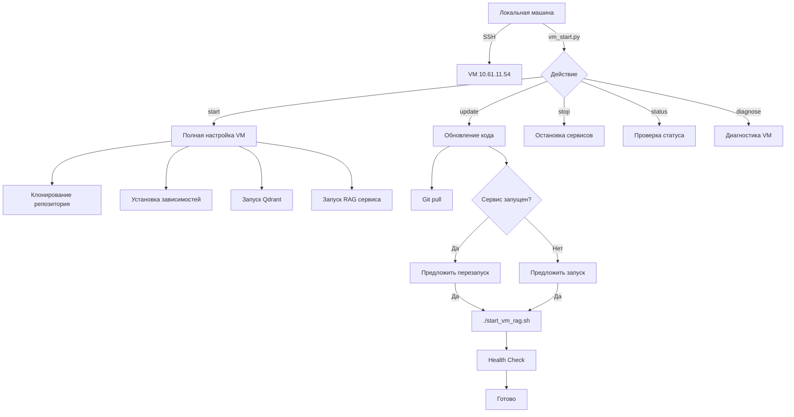
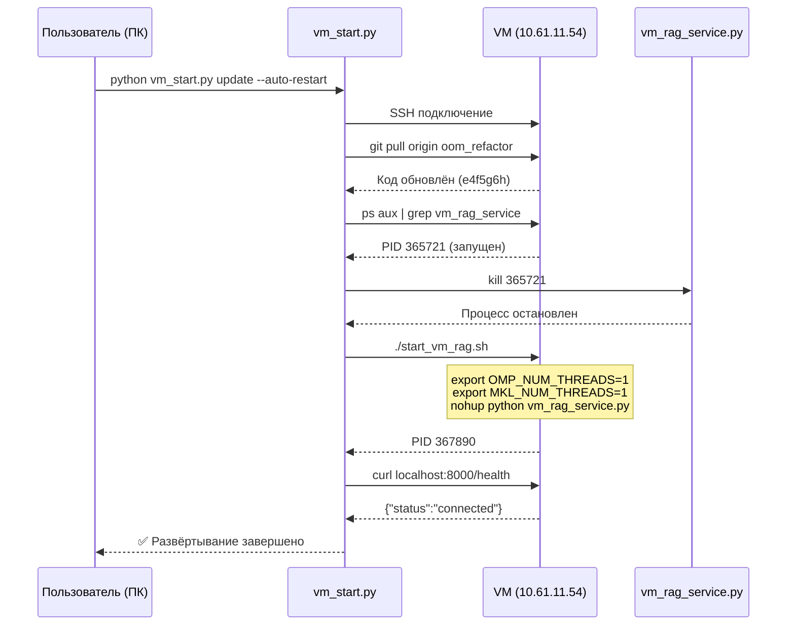
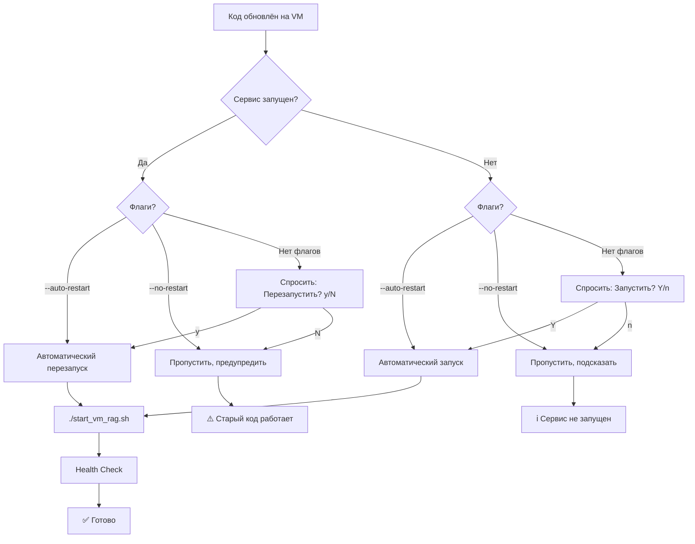

# 📘 vm_start.py - Comprehensive Guide

**Дата создания:** 03 октября 2025  
**Версия:** 2.0 (с управлением сервисами)  
**Автор:** Technical Documentation Expert  
**Статус:** Production Ready

---

## 📑 Содержание

1. [Введение](#введение)
2. [Архитектура и принцип работы](#архитектура)
3. [Детальное описание функций](#функции)
4. [Сценарии использования](#сценарии)
5. [Примеры команд](#примеры)
6. [Флаги и параметры](#флаги)
7. [Workflow диаграммы](#диаграммы)
8. [Troubleshooting](#troubleshooting)
9. [Best Practices](#best-practices)
10. [FAQ](#faq)
11. [Технические детали](#технические-детали)
12. [Связь с OOM рефакторингом](#oom-рефакторинг)
13. [Связанная документация](#связанная-документация)

---

## 1. Введение {#введение}

### Что такое vm_start.py?

[`vm_start.py`](../vm_start.py:1-1394) - это автоматизированный инструмент для управления развёртыванием кода и сервисами на удалённой VM (Virtual Machine) 10.61.11.54.

**Основные возможности:**
- 🔄 Автоматическое обновление кода через git (fetch + pull)
- 🚀 Управление жизненным циклом сервисов (запуск/остановка/перезапуск)
- ✅ Проверка работоспособности (health checks)
- 🔐 Безопасное SSH подключение с автоматической аутентификацией
- 📊 Диагностика состояния VM и сервисов
- 🔀 Интерактивный выбор ветки для развёртывания

### Когда использовать?

**Используйте vm_start.py когда:**
- ✅ Вы внесли изменения в код локально и хотите развернуть на VM
- ✅ Нужно проверить статус сервиса на VM
- ✅ Требуется перезапустить сервис после изменений кода
- ✅ Нужна полная диагностика состояния VM
- ✅ Хотите переключиться на другую ветку git

**НЕ используйте когда:**
- ❌ Просто хотите проверить логи (используйте прямое SSH: `ssh user@10.61.11.54 "tail -f ~/repo_sum_rag/repo_sum/rag_service.log"`)
- ❌ Нужно только запустить/остановить сервис вручную (используйте `./start_vm_rag.sh` на VM)
- ❌ Хотите внести временные изменения на VM без коммита

### Связь с OOM оптимизациями

После применения **Фазы 2 OOM рефакторинга** (03.10.2025), [`vm_start.py`](../vm_start.py:1-1394) интегрирован с:
- ✅ [`start_vm_rag.sh`](../scripts/vm_phase2_setup.sh) - скрипт запуска с переменными OMP/MKL
- ✅ Переменные окружения: `OMP_NUM_THREADS=1`, `MKL_NUM_THREADS=1`, `TORCH_NUM_THREADS=1`, `OPENBLAS_NUM_THREADS=1`
- ✅ Swap 32GB конфигурация на VM (вместо 64GB - недостаточно места)
- ✅ Верификация применения переменных через `/proc/PID/environ`

**Важно:** Всегда используйте `start_vm_rag.sh` для запуска сервиса, а не прямой `python vm_rag_service.py`, чтобы применить оптимизации памяти.

---

## 2. Архитектура и принцип работы {#архитектура}

### Общая схема



### Компоненты системы

**На локальной машине:**
- [`vm_start.py`](../vm_start.py:1-1394) - главный скрипт управления
- SSH ключи или пароль для аутентификации (из `.env`)
- Git репозиторий с кодом (синхронизируется с VM)

**На VM (10.61.11.54):**
- `~/repo_sum_rag/repo_sum/` - рабочая директория проекта
- `venv/` - виртуальное окружение Python 3.10
- [`vm_rag_service.py`](../vm_rag_service.py:1-400) - FastAPI сервис эмбеддингов
- `start_vm_rag.sh` - скрипт запуска с переменными OMP/MKL (см. [VM_STARTUP_CONFIGURATION.md](VM_STARTUP_CONFIGURATION.md))
- `rag_service.pid` - файл с PID процесса
- `rag_service.log` - логи сервиса (stdout/stderr)
- Docker контейнер с Qdrant (localhost:6333)

### Порядок операций при `update`

1. **Подключение к VM** через SSH (paramiko)
2. **Переход в рабочую директорию** `~/repo_sum_rag/repo_sum`
3. **Git операции:**
   - `git fetch --all --prune` - получение всех обновлений
   - `git checkout <branch>` - переключение на нужную ветку (по умолчанию: oom_refactor)
   - `git reset --hard origin/<branch>` - принудительное обновление
   - `git clean -fd` - очистка непонятных файлов
4. **Проверка статуса сервиса** через `ps aux | grep vm_rag_service`
5. **Управление сервисом:**
   - Если запущен → предложить перезапуск (интерактивно или --auto-restart)
   - Если не запущен → предложить запуск (интерактивно)
6. **Запуск через start_vm_rag.sh** (если существует) с применением OMP/MKL переменных
7. **Health check** на `http://localhost:8000/health`
8. **Отчёт о результатах** с информацией о версии и статусе

---

## 3. Детальное описание функций {#функции}

### Класс VMSetupManager

#### `__init__(self)`

**Локация:** [`vm_start.py:54-83`](../vm_start.py:54-83)

**Назначение:** Инициализация менеджера подключения к VM с загрузкой параметров из `.env`

**Параметры из .env:**
- `VM_HOST` - IP или hostname VM (по умолчанию: "10.61.11.54")
- `VM_USER` - Имя пользователя SSH (по умолчанию: "user")
- `VM_PASSWORD` - Пароль SSH (обязательный, если нет ключей)
- `VM_PORT` - Порт SSH (по умолчанию: 22)
- `VM_REPO_URL` - URL репозитория (по умолчанию: "https://github.com/Bondartsov/repo_sum.git")
- `VM_REPO_BRANCH` - Ветка по умолчанию (по умолчанию: "jina-embeddings-v3")

**Пример:**
```python
manager = VMSetupManager()
# Автоматически загружает параметры из .env
# Проверяет наличие VM_PASSWORD
```

**Исключения:**
- `ValueError` - если VM_PASSWORD не найден в .env

---

#### `connect_ssh(self) -> bool`

**Локация:** [`vm_start.py:85-108`](../vm_start.py:85-108)

**Назначение:** Установка SSH соединения с VM

**Как работает:**
1. Создаёт SSH клиент через paramiko
2. Устанавливает `AutoAddPolicy` для автоматического принятия host keys
3. Подключается к VM с параметрами из `.env`
4. Таймаут подключения: 30 секунд

**Возвращает:** 
- `True` - если подключение успешно
- `False` - если произошла ошибка

**Пример использования:**
```python
if manager.connect_ssh():
    print("Подключение установлено")
    # Выполняем команды на VM
else:
    print("Ошибка подключения")
    sys.exit(1)
```

**Особенности:**
- Использует пароль из .env (можно заменить на SSH ключи)
- Логирует успешные и неуспешные попытки
- Сохраняет SSH клиент в `self.ssh_client` для последующих команд

---

#### `execute_command(self, command: str, timeout: int = 30, ignore_exit_codes: list = None) -> Tuple[bool, str, str]`

**Локация:** [`vm_start.py:110-145`](../vm_start.py:110-145)

**Назначение:** Выполнение команды на VM через SSH

**Параметры:**
- `command` (str) - Команда для выполнения (bash синтаксис)
- `timeout` (int) - Таймаут в секундах (по умолчанию: 30)
- `ignore_exit_codes` (list) - Список кодов возврата, которые не считаются ошибкой

**Возвращает:** 
- `Tuple[success: bool, stdout: str, stderr: str]`

**Пример:**
```python
# Простая команда
success, output, error = manager.execute_command("ls -la ~/repo_sum_rag")

# С таймаутом 60 секунд
success, output, error = manager.execute_command(
    "git pull origin main", 
    timeout=60
)

# Игнорирование exit code 7 (для nohup)
success, output, error = manager.execute_command(
    "nohup python script.py &",
    ignore_exit_codes=[7, 127]
)
```

**Особенности:**
- Ожидает завершения команды (не асинхронно)
- Декодирует output в UTF-8
- Логирует только реальные ошибки (не игнорируемые коды)

---

#### `check_service_running(self, service_name: str = "vm_rag_service.py") -> bool`

**Локация:** [`vm_start.py:793-798`](../vm_start.py:793-798)

**Назначение:** Проверить запущен ли сервис на VM

**Как работает:**
1. Выполняет команду `ps aux | grep 'vm_rag_service.py' | grep -v grep` на VM
2. Парсит вывод
3. Возвращает `True` если процесс найден, `False` если нет

**Параметры:**
- `service_name` (str) - Имя процесса для поиска (по умолчанию: "vm_rag_service.py")

**Возвращает:** 
- `True` - сервис запущен
- `False` - сервис остановлен

**Пример использования:**
```python
if manager.check_service_running():
    print("✅ Сервис работает")
else:
    print("❌ Сервис остановлен")
```

---

#### `get_service_pid(self, pid_file: str = None) -> Optional[str]`

**Локация:** [`vm_start.py:800-807`](../vm_start.py:800-807)

**Назначение:** Получить PID процесса из файла на VM

**Как работает:**
1. Читает файл `rag_service.pid` на VM
2. Извлекает PID (число)
3. Возвращает строку с PID или `None` если файл не найден

**Параметры:**
- `pid_file` (str, optional) - Путь к PID файлу на VM (по умолчанию: `~/repo_sum_rag/repo_sum/rag_service.pid`)

**Возвращает:** 
- `str` - PID процесса (например: "365721")
- `None` - если файл не найден или пуст

**Пример:**
```python
pid = manager.get_service_pid()
if pid:
    print(f"Процесс запущен с PID {pid}")
    # Можно использовать для kill или мониторинга
else:
    print("PID файл не найден")
```

---

#### `stop_service(self, pid_file: str = None) -> bool`

**Локация:** [`vm_start.py:809-837`](../vm_start.py:809-837)

**Назначение:** Остановить сервис gracefully (с fallback на force kill)

**Как работает:**
1. Получает PID из файла через [`get_service_pid()`](../vm_start.py:800-807)
2. Пытается `kill <PID>` (graceful shutdown с SIGTERM)
3. Ждёт 2 секунды
4. Если процесс всё ещё работает, пробует `kill -9 <PID>` (force kill с SIGKILL)
5. Fallback: `pkill -f vm_rag_service.py` если PID файла нет

**Параметры:**
- `pid_file` (str, optional) - Путь к PID файлу на VM

**Возвращает:** 
- `True` - сервис успешно остановлен
- `False` - не удалось остановить сервис

**Пример:**
```python
if manager.stop_service():
    print("✅ Сервис остановлен")
else:
    print("❌ Не удалось остановить сервис")
    # Может потребоваться ручное вмешательство
```

**Важно:** Всегда проверяйте логи после остановки на наличие ошибок:
```bash
ssh user@10.61.11.54 "tail -20 ~/repo_sum_rag/repo_sum/rag_service.log"
```

---

#### `start_service_via_script(self, script_path: str = None) -> bool`

**Локация:** [`vm_start.py:839-877`](../vm_start.py:839-877)

**Назначение:** Запустить сервис через скрипт с переменными OMP/MKL (Фаза 2 оптимизаций)

**Как работает:**
1. Проверяет существование скрипта `start_vm_rag.sh` на VM
2. Если скрипт НЕ найден:
   - ❌ Выводит сообщение об ошибке
   - 💡 Показывает ссылку на [документацию](VM_STARTUP_CONFIGURATION.md) для создания
   - Возвращает `False`
3. Если скрипт найден:
   - ✅ Выполняет `cd ~/repo_sum_rag/repo_sum && ./start_vm_rag.sh`
   - 📊 Выводит output скрипта (включая PID и переменные окружения)
   - ⏳ Ждёт 3 секунды для запуска
   - ✅ Проверяет что процесс запустился через [`check_service_running()`](../vm_start.py:793-798)
   - 📌 Получает PID через [`get_service_pid()`](../vm_start.py:800-807)

**Параметры:**
- `script_path` (str, optional) - Путь к скрипту на VM (по умолчанию: `~/repo_sum_rag/repo_sum/start_vm_rag.sh`)

**Возвращает:** 
- `True` - сервис успешно запущен с оптимизациями
- `False` - не удалось запустить (скрипт не найден или ошибка запуска)

**Важно:** Этот метод предпочтительнее [`start_rag_service()`](../vm_start.py:923-1026) т.к. применяет переменные OMP/MKL для оптимизации памяти (Фаза 2).

**Пример вывода при успешном запуске:**
```
🚀 Запуск сервиса через ~/repo_sum_rag/repo_sum/start_vm_rag.sh...
VM RAG Service started with PID: 365721
OMP_NUM_THREADS=1
MKL_NUM_THREADS=1
TORCH_NUM_THREADS=1
⏳ Ожидание запуска сервиса...
✅ Сервис запущен с PID 365721
```

**Пример использования:**
```python
if manager.start_service_via_script():
    print("✅ Сервис запущен с оптимизациями памяти")
    manager.verify_service_health()
else:
    print("❌ Не удалось запустить через скрипт")
    # Fallback на стандартный метод:
    manager.start_rag_service()
```

---

#### `restart_service(self) -> bool`

**Локация:** [`vm_start.py:879-895`](../vm_start.py:879-895)

**Назначение:** Перезапустить сервис (остановка + запуск)

**Как работает:**
1. Останавливает сервис через [`stop_service()`](../vm_start.py:809-837)
2. Ждёт 2 секунды для корректного завершения
3. Проверяет наличие `start_vm_rag.sh`:
   - ✅ Если есть: использует [`start_service_via_script()`](../vm_start.py:839-877) (с OMP/MKL)
   - ❌ Если нет: использует стандартный [`start_rag_service()`](../vm_start.py:923-1026)

**Возвращает:** 
- `True` - сервис успешно перезапущен
- `False` - не удалось перезапустить

**Пример:**
```python
if manager.restart_service():
    print("✅ Сервис перезапущен успешно")
    manager.verify_service_health()
else:
    print("❌ Ошибка перезапуска")
```

**Важно:** Всегда проверяйте health endpoint после перезапуска:
```python
if manager.restart_service():
    if manager.verify_service_health():
        print("🎉 Сервис работает корректно")
    else:
        print("⚠️ Сервис запущен, но health check не пройден")
```

---

#### `verify_service_health(self, health_url: str = None) -> bool`

**Локация:** [`vm_start.py:897-920`](../vm_start.py:897-920)

**Назначение:** Проверить работоспособность сервиса через HTTP endpoint

**Как работает:**
1. Выполняет `curl -s http://localhost:8000/health` на VM
2. Парсит JSON ответ
3. Ищет ключевые слова: "connected", "status", "ok"
4. Выводит превью ответа (первые 200 символов)

**Параметры:**
- `health_url` (str, optional) - URL health endpoint (по умолчанию: "http://localhost:8000/health")

**Возвращает:** 
- `True` - сервис отвечает корректно
- `False` - health check не пройден

**Пример ожидаемого ответа:**
```json
{
  "status": "connected",
  "services": {
    "embedder": {"status": "connected"},
    "vector_store": {"status": "connected"}
  },
  "timestamp": "2025-10-03T14:00:00Z"
}
```

**Пример использования:**
```python
if manager.verify_service_health():
    print("✅ Health check пройден")
else:
    print("⚠️ Health check не пройден")
    # Проверить логи:
    _, logs, _ = manager.execute_command(
        "tail -20 ~/repo_sum_rag/repo_sum/rag_service.log"
    )
    print(logs)
```

---

#### `update_code_on_vm(self) -> bool`

**Локация:** [`vm_start.py:1185-1208`](../vm_start.py:1185-1208)

**Назначение:** Синхронизация кода репозитория на VM с указанной веткой

**Как работает:**
1. Интерактивный выбор ветки (если не указан через `--branch`):
   - Получает список веток через [`get_available_branches()`](../vm_start.py:219-293)
   - Показывает красивую таблицу с информацией о коммитах и датах
   - Запрашивает выбор пользователя
2. Вызывает [`setup_repository()`](../vm_start.py:352-458) для синхронизации
3. Выводит информацию об изменениях (старый vs новый коммит)

**Возвращает:** 
- `True` - код успешно синхронизирован
- `False` - ошибка синхронизации

**Пример интерактивного выбора:**
```
📁 Выберите ветку для развертывания
┏━━━┳━━━━━━━━━━━━━━━━━━━┳━━━━━━━━━┳━━━━━━━━━━━━┓
┃ № ┃ Ветка             ┃ Коммит  ┃ Дата       ┃
┡━━━╇━━━━━━━━━━━━━━━━━━━╇━━━━━━━━━╇━━━━━━━━━━━━┩
│ 1 │ main              │ a1b2c3d │ 01.10.2025 │
│ 2 │ oom_refactor      │ e4f5g6h │ 03.10.2025 │
│ 3 │ jina-embeddings-v3│ i7j8k9l │ 02.10.2025 │
└───┴───────────────────┴─────────┴────────────┘

Введите номер ветки [1-3] или 'q' для отмены: 2
✅ Выбрана ветка: oom_refactor
```

**Пример использования:**
```python
if manager.update_code_on_vm():
    print("✅ Код на VM синхронизирован")
    # Теперь можно перезапустить сервис
else:
    print("❌ Ошибка обновления кода")
```

---

#### `diagnose_rag_service(self) -> dict`

**Локация:** [`vm_start.py:720-792`](../vm_start.py:720-792)

**Назначение:** Полная диагностика проблем с RAG сервисом

**Что проверяет:**
1. 🔍 **Процесс running:** `ps aux | grep vm_rag_service`
2. 🔌 **Порт 8000:** `netstat -tulnp | grep :8000`
3. 📄 **Логи:** `tail -20 rag_service.log`
4. 🐍 **Python imports:** проверка импорта `from vm_rag_service import app`
5. 🧪 **Ручной запуск:** тест запуска с timeout 10s

**Возвращает:** 
- `dict` с диагностической информацией:
  ```python
  {
      'process_running': bool,
      'port_available': bool,
      'logs_exist': bool,
      'python_imports_ok': bool,
      'service_logs': str,
      'error_details': List[str]
  }
  ```

**Пример использования:**
```python
diagnostics = manager.diagnose_rag_service()

if not diagnostics['process_running']:
    print("❌ Процесс не запущен")
    
if not diagnostics['python_imports_ok']:
    print("❌ Проблемы с импортами Python")
    print(diagnostics['error_details'])

if diagnostics['logs_exist']:
    print(f"📄 Логи:\n{diagnostics['service_logs']}")
```

---

## 4. Сценарии использования {#сценарии}

### Сценарий 1: Первое развёртывание кода

**Ситуация:** Вы внесли изменения в код локально впервые, на VM сервис НЕ запущен.

**Команда:**
```powershell
python vm_start.py update
```

**Что произойдёт:**

1. 🔗 Подключение к VM через SSH
2. 📁 Интерактивный выбор ветки (или использование дефолтной)
3. 🔄 Git pull в `~/repo_sum_rag/repo_sum/`
4. ✅ Проверка: Сервис НЕ запущен
5. ❓ Вопрос: "Запустить сервис? (Y/n):"
   - Если `Y` → запуск через `./start_vm_rag.sh` (с OMP/MKL оптимизациями)
   - Если `n` → подсказка как запустить вручную
6. 🏥 Health check на `http://localhost:8000/health`
7. 📊 Отчёт о результатах

**Ожидаемый вывод:**
```
🔗 Подключение к VM 10.61.11.54...
✅ SSH подключение установлено
🔄 Обновляю код на VM...
📁 Настраиваю репозиторий...
✅ Репозиторий обновлён: версия обновлена с ветки (main) a1b2c3d (01.10.2025) на ветку (oom_refactor) e4f5g6h (03.10.2025)
✅ Код на VM синхронизирован

============================================================
УПРАВЛЕНИЕ СЕРВИСОМ
============================================================
⚠️ Сервис НЕ запущен
Запустить сервис? (Y/n): Y
🚀 Запуск сервиса через ~/repo_sum_rag/repo_sum/start_vm_rag.sh...
VM RAG Service started with PID: 365721
OMP_NUM_THREADS=1
MKL_NUM_THREADS=1
⏳ Ожидание запуска сервиса...
✅ Сервис запущен с PID 365721
🏥 Проверка health endpoint...
✅ Health check пройден
{"status":"connected","services":{"embedder":{"status":"connected"},"vector_store":{"status":"connected"}}...}
```

---

### Сценарий 2: Обновление кода с автоматическим перезапуском

**Ситуация:** Сервис уже работает, вы хотите обновить код и АВТОМАТИЧЕСКИ перезапустить сервис.

**Команда:**
```powershell
python vm_start.py update --auto-restart
```

**Что произойдёт:**

1. 🔄 Git pull
2. 🛑 Автоматическая остановка текущего процесса (kill PID)
3. 🚀 Автоматический запуск через `./start_vm_rag.sh`
4. 🏥 Health check
5. БЕЗ интерактивных вопросов (полностью автоматически)

**Использование в CI/CD:**
Этот режим идеален для автоматических deployment скриптов:

```yaml
# .github/workflows/deploy.yml
- name: Deploy to VM
  run: python vm_start.py update --branch production --auto-restart
```

**Ожидаемый вывод:**
```
🔄 Обновляю код на VM...
✅ Репозиторий обновлён: версия e4f5g6h (03.10.2025)
✅ Сервис запущен
🔄 Автоматический перезапуск (--auto-restart)
🛑 Остановка процесса PID 365721...
✅ Сервис остановлен
🚀 Запуск сервиса через start_vm_rag.sh...
✅ Сервис запущен с PID 367890
🏥 Проверка health endpoint...
✅ Health check пройден
```

---

### Сценарий 3: Обновление кода БЕЗ перезапуска

**Ситуация:** Вы хотите обновить код, но НЕ хотите перезапускать рабочий сервис прямо сейчас (например, под нагрузкой).

**Команда:**
```powershell
python vm_start.py update --no-restart
```

**Что произойдёт:**

1. 🔄 Git pull
2. ✅ Проверка статуса сервиса
3. ⏭️ Сообщение: "Перезапуск пропущен (--no-restart)"
4. ⚠️ **ВАЖНО:** Сервис продолжит работать со СТАРЫМ кодом!
5. 💡 Подсказка о ручном перезапуске

**Когда использовать:**
- ✅ Production сервис под нагрузкой
- ✅ Планируете перезапуск в определённое время (ночью)
- ✅ Хотите сначала проверить логи и состояние

**Ожидаемый вывод:**
```
🔄 Обновляю код на VM...
✅ Код обновлён: e4f5g6h (03.10.2025)
✅ Сервис запущен (PID 365721)
⏭️ Перезапуск пропущен (--no-restart)
⚠️ Сервис продолжит работать со СТАРЫМ кодом
💡 Для применения изменений потребуется ручной перезапуск
```

**Ручной перезапуск потом:**
```powershell
# Способ 1: Через vm_start.py
python vm_start.py update --auto-restart

# Способ 2: Прямо на VM
ssh user@10.61.11.54
cd ~/repo_sum_rag/repo_sum
kill $(cat rag_service.pid)
./start_vm_rag.sh
```

---

### Сценарий 4: Только проверка статуса

**Ситуация:** Хотите проверить работает ли сервис, без изменения кода.

**Команда:**
```powershell
python vm_start.py update --check-only
```

**Что произойдёт:**

1. 🔗 Подключение к VM
2. 🔍 Проверка статуса процесса `ps aux | grep vm_rag_service`
3. 📌 Показ PID если запущен
4. 🏥 Health check если запущен
5. БЕЗ git операций
6. БЕЗ перезапуска

**Ожидаемый вывод:**
```
============================================================
ПРОВЕРКА СТАТУСА СЕРВИСА
============================================================
✅ Сервис запущен (PID 365721)
🏥 Проверка health endpoint...
✅ Health check пройден
{"status":"connected","services":{"embedder":{"status":"connected"}...}
```

**Альтернативный способ (без vm_start.py):**
```powershell
# Прямо на VM
ssh user@10.61.11.54 "ps aux | grep vm_rag_service | grep -v grep"
ssh user@10.61.11.54 "curl -s http://localhost:8000/health | jq ."
```

---

### Сценарий 5: Интерактивный режим (по умолчанию)

**Ситуация:** Вы хотите контролировать каждый шаг вручную.

**Команда:**
```powershell
python vm_start.py update
```

**Интерактивные вопросы:**

**Если сервис запущен:**
```
✅ Сервис запущен
Перезапустить сервис для применения нового кода? (y/N): 
```
- `y` → перезапуск + health check
- `N` (или Enter) → предупреждение что работает старый код

**Если сервис НЕ запущен:**
```
⚠️ Сервис НЕ запущен
Запустить сервис? (Y/n):
```
- `Y` (или Enter) → запуск + health check
- `n` → подсказка о ручном запуске

**Пример полного диалога:**
```
🔄 Обновляю код на VM...

📁 Выберите ветку для развертывания
┏━━━┳━━━━━━━━━━━━━━━━━━━┳━━━━━━━━━┳━━━━━━━━━━━━┓
┃ № ┃ Ветка             ┃ Коммит  ┃ Дата       ┃
┡━━━╇━━━━━━━━━━━━━━━━━━━╇━━━━━━━━━╇━━━━━━━━━━━━┩
│ 1 │ main              │ a1b2c3d │ 01.10.2025 │
│ 2 │ oom_refactor      │ e4f5g6h │ 03.10.2025 │
└───┴───────────────────┴─────────┴────────────┘

Введите номер ветки [1-2] или 'q' для отмены: 2
✅ Выбрана ветка: oom_refactor
✅ Код обновлён

✅ Сервис запущен
Перезапустить сервис для применения нового кода? (y/N): y
🔄 Перезапуск сервиса...
✅ Сервис перезапущен с PID 367890
✅ Health check пройден
```

---

### Сценарий 6: Полная настройка VM с нуля

**Ситуация:** Первое развёртывание на новой VM или после полной очистки.

**Команда:**
```powershell
python vm_start.py start
```

**Что произойдёт:**

1. 🔗 SSH подключение
2. 📁 Интерактивный выбор ветки для клонирования
3. 📥 Клонирование репозитория (если не существует)
4. 🐍 Создание виртуального окружения Python
5. 📦 Установка зависимостей из `requirements.txt`
6. 🧪 Тестирование загрузки Jina v3
7. 🗄️ Запуск Qdrant в Docker
8. ⚙️ Создание `.env` файла на VM
9. 🚀 Запуск RAG сервиса
10. 🧪 Тестирование всей системы

**Время выполнения:** 10-15 минут (первый раз)

---

## 5. Примеры команд {#примеры}

### Базовые команды

#### Обновление кода и интерактивный режим
```powershell
python vm_start.py update
```
Показывает список веток, запрашивает подтверждение для перезапуска.

#### Обновление кода с автоперезапуском
```powershell
python vm_start.py update --auto-restart
```
Автоматически перезапускает сервис без вопросов.

#### Обновление кода БЕЗ перезапуска
```powershell
python vm_start.py update --no-restart
```
Только обновляет код, сервис продолжает работать со старым кодом.

#### Только проверка статуса
```powershell
python vm_start.py update --check-only
```
Проверяет статус без изменений (git pull не выполняется).

---

### Работа с ветками

#### Обновить конкретную ветку
```powershell
python vm_start.py update --branch oom_refactor --auto-restart
```
Пропускает интерактивный выбор, сразу переключается на указанную ветку.

#### Переключиться на main и перезапустить
```powershell
python vm_start.py update --branch main --auto-restart
```

#### Переключиться на feature ветку без перезапуска
```powershell
python vm_start.py update --branch feature-new-embedder --no-restart
```

---

### Другие действия

#### Запуск сервиса (если остановлен)
```powershell
python vm_start.py start
```
Полная настройка VM (клонирование, установка, запуск).

#### Остановка сервиса
```powershell
python vm_start.py stop
```
Останавливает RAG сервис и Qdrant.

#### Проверка статуса VM
```powershell
python vm_start.py status
```
Показывает таблицу со статусом всех компонентов.

#### Диагностика VM
```powershell
python vm_start.py diagnose
```
Полная диагностика проблем с сервисом.

---

### Продвинутые сценарии

#### CI/CD deployment
```powershell
# В GitHub Actions / Azure DevOps
python vm_start.py update --branch production --auto-restart
```

#### Ночной restart для обновления
```powershell
# В Windows Task Scheduler (запуск в 03:00)
python vm_start.py update --auto-restart
```

#### Проверка перед важной презентацией
```powershell
python vm_start.py update --check-only
# Если всё OK:
python vm_start.py update --auto-restart
```

#### Откат на предыдущую ветку
```powershell
# Откатить на main
python vm_start.py update --branch main --auto-restart
```

---

## 6. Флаги и параметры {#флаги}

### Полный список флагов

| Флаг | Тип | Описание | Пример |
|------|-----|----------|---------|
| `--auto-restart` | bool | Автоматически перезапустить сервис после update | `--auto-restart` |
| `--no-restart` | bool | НЕ перезапускать сервис после update | `--no-restart` |
| `--check-only` | bool | Только проверка статуса, без изменений | `--check-only` |
| `--branch <name>` | str | Имя ветки git для checkout | `--branch oom_refactor` |

### Комбинации флагов

#### Автоперезапуск + конкретная ветка
```powershell
python vm_start.py update --branch oom_refactor --auto-restart
```
**Использование:** Автоматическое развёртывание конкретной ветки.

#### Проверка без изменений (мониторинг)
```powershell
python vm_start.py update --check-only
```
**Использование:** Периодическая проверка здоровья сервиса.

#### Обновление без перезапуска production
```powershell
python vm_start.py update --branch production --no-restart
```
**Использование:** Подготовка кода для перезапуска в off-peak hours.

---

### Конфликтующие флаги

**⚠️ Взаимоисключающие:**
- `--auto-restart` и `--no-restart` нельзя использовать вместе
- `--check-only` игнорирует другие флаги (не выполняет git операции)

**Примеры некорректного использования:**
```powershell
# ❌ Ошибка: конфликт флагов
python vm_start.py update --auto-restart --no-restart

# ✅ Правильно: выберите один
python vm_start.py update --auto-restart
# ИЛИ
python vm_start.py update --no-restart
```

---

## 7. Workflow диаграммы {#диаграммы}

### Workflow: Обновление кода с перезапуском



---

### Workflow: Проверка статуса

```mermaid
flowchart TD
    A[python vm_start.py update --check-only] --> B[SSH подключение]
    B --> C[ps aux | grep vm_rag_service]
    
    C --> D{Процесс найден?}
    
    D -->|Да| E[cat rag_service.pid]
    E --> F[Показать PID]
    F --> G[curl localhost:8000/health]
    G --> H{Health OK?}
    H -->|Да| I[✅ Сервис работает]
    H -->|Нет| J[⚠️ Сервис запущен но не отвечает]
    
    D -->|Нет| K[ℹ️ Сервис не запущен]
```

---

### Decision Tree: Что делать после update



---

### Lifecycle: Полная настройка VM


---

## 8. Troubleshooting {#troubleshooting}

### Проблема: "Скрипт start_vm_rag.sh не найден"

**Симптом:**
```
❌ Скрипт ~/repo_sum_rag/repo_sum/start_vm_rag.sh не найден!
💡 Создайте скрипт согласно docs/VM_STARTUP_CONFIGURATION.md
💡 Или используйте python vm_start.py start для запуска без скрипта
```

**Причина:** Скрипт в `.gitignore` и не синхронизируется с git

**Решение 1: Создать скрипт на VM вручную**
```powershell
ssh user@10.61.11.54

# На VM:
cat > ~/repo_sum_rag/repo_sum/start_vm_rag.sh << 'EOF'
#!/bin/bash
cd ~/repo_sum_rag/repo_sum
source venv/bin/activate

# Ограничение потоков для Jina v3 (Фаза 2 OOM refactor)
export OMP_NUM_THREADS=1
export MKL_NUM_THREADS=1
export TORCH_NUM_THREADS=1
export OPENBLAS_NUM_THREADS=1

# Запуск сервиса
nohup python vm_rag_service.py > rag_service.log 2>&1 &
echo $! > rag_service.pid

echo "VM RAG Service started with PID: $(cat rag_service.pid)"
echo "OMP_NUM_THREADS=$OMP_NUM_THREADS"
echo "MKL_NUM_THREADS=$MKL_NUM_THREADS"
echo "TORCH_NUM_THREADS=$TORCH_NUM_THREADS"
EOF

chmod +x ~/repo_sum_rag/repo_sum/start_vm_rag.sh
```

**Решение 2: Использовать scp для копирования**
```powershell
# Если скрипт есть в scripts/
scp scripts/vm_phase2_setup.sh user@10.61.11.54:~/repo_sum_rag/repo_sum/start_vm_rag.sh
```

**Решение 3: Fallback на стандартный запуск**
`vm_start.py` автоматически использует fallback на стандартный [`start_rag_service()`](../vm_start.py:923-1026), НО без переменных OMP/MKL (не рекомендуется).

---

### Проблема: "Сервис не останавливается"

**Симптом:**
```
🛑 Остановка процесса PID 365721...
⚠️ Процесс всё ещё работает, пробуем kill -9...
❌ Не удалось остановить сервис!
```

**Причина:** Процесс завис или не отвечает на SIGTERM

**Решение: Принудительная остановка на VM**
```powershell
ssh user@10.61.11.54

# Способ 1: Через PID файл
kill -9 $(cat ~/repo_sum_rag/repo_sum/rag_service.pid)

# Способ 2: Через pkill
pkill -9 -f vm_rag_service.py

# Проверка
ps aux | grep vm_rag_service | grep -v grep
# Должно быть пусто
```

**Проверка логов:**
```powershell
ssh user@10.61.11.54 "tail -50 ~/repo_sum_rag/repo_sum/rag_service.log"
```

---

### Проблема: "Health check не пройден"

**Симптом:**
```
🏥 Проверка health endpoint...
⚠️ Health check не пройден
curl: (7) Failed to connect to localhost port 8000: Connection refused
```

**Возможные причины:**
1. Сервис ещё не запустился (слишком быстрая проверка)
2. Сервис упал при запуске (ошибка в коде)
3. Порт 8000 занят другим процессом
4. Firewall блокирует localhost:8000

**Решение 1: Проверить логи**
```powershell
ssh user@10.61.11.54 "tail -100 ~/repo_sum_rag/repo_sum/rag_service.log"
```

Ищите ошибки:
- `ModuleNotFoundError` - не установлены зависимости
- `Address already in use` - порт занят
- `OOM killer` - недостаточно памяти
- `ImportError` - проблемы с импортами

**Решение 2: Проверить что процесс запущен**
```powershell
ssh user@10.61.11.54 "ps aux | grep vm_rag_service | grep -v grep"
```

Если процесса НЕТ - проверить логи на момент запуска.

**Решение 3: Проверить порт 8000**
```powershell
ssh user@10.61.11.54 "netstat -tlnp | grep 8000"
# Или
ssh user@10.61.11.54 "lsof -i :8000"
```

Если порт занят другим процессом:
```powershell
# Узнать PID процесса на порту 8000
ssh user@10.61.11.54 "lsof -i :8000 | grep LISTEN"

# Остановить процесс
ssh user@10.61.11.54 "kill <PID>"
```

**Решение 4: Подождать дольше**
Jina v3 (570M параметров) может загружаться 10-30 секунд. Попробуйте:
```powershell
ssh user@10.61.11.54 "watch -n 2 'curl -s http://localhost:8000/health || echo waiting...'"
```

---

### Проблема: "SSH подключение не удалось"

**Симптом:**
```
❌ Ошибка SSH подключения
paramiko.ssh_exception.AuthenticationException: Authentication failed.
```

**Причины:**
1. Неправильный пароль в `.env`
2. SSH ключи не настроены
3. VM недоступна (сеть)
4. Firewall блокирует SSH (порт 22)

**Решение 1: Проверить доступность VM**
```powershell
# Ping
ping 10.61.11.54

# Проверка порта SSH
Test-NetConnection -ComputerName 10.61.11.54 -Port 22
```

**Решение 2: Проверить пароль в .env**
```powershell
# Посмотреть текущий пароль
type .env | findstr VM_PASSWORD

# Проверить подключение напрямую
ssh user@10.61.11.54
# Если не работает - пароль неверен
```

**Решение 3: Настроить SSH ключи (рекомендуется)**
```powershell
# Генерация ключа (если нет)
ssh-keygen -t ed25519 -C "your_email@example.com"

# Копирование на VM
ssh-copy-id user@10.61.11.54

# Проверка
ssh user@10.61.11.54 "echo SSH Key Auth Works"
```

**Решение 4: Проверить VM_HOST в .env**
```ini
# .env файл
VM_HOST=10.61.11.54  # Правильный IP?
VM_USER=user         # Правильный пользователь?
VM_PASSWORD=***      # Правильный пароль?
VM_PORT=22           # Правильный порт?
```

---

### Проблема: "Git pull конфликты"

**Симптом:**
```
❌ Ошибка синхронизации репозитория
error: Your local changes to the following files would be overwritten by merge:
    vm_rag_service.py
Please commit your changes or stash them before you merge.
```

**Причина:** Локальные изменения на VM конфликтуют с изменениями в git

**Решение 1: Stash изменения (сохранить временно)**
```powershell
ssh user@10.61.11.54
cd ~/repo_sum_rag/repo_sum

# Сохранить изменения
git stash save "temp changes before update"

# Обновить
git pull

# Восстановить изменения (опционально)
git stash pop
```

**Решение 2: Hard reset (ОСТОРОЖНО! Удаляет локальные изменения)**
```powershell
ssh user@10.61.11.54
cd ~/repo_sum_rag/repo_sum

# ОСТОРОЖНО: удалит все локальные изменения!
git reset --hard origin/oom_refactor
git clean -fd
git pull
```

**Решение 3: Проверить что именно изменено**
```powershell
ssh user@10.61.11.54 "cd ~/repo_sum_rag/repo_sum && git status"
ssh user@10.61.11.54 "cd ~/repo_sum_rag/repo_sum && git diff"
```

Если изменения важны - создать резервную копию:
```powershell
ssh user@10.61.11.54 "cd ~/repo_sum_rag/repo_sum && cp vm_rag_service.py vm_rag_service.py.backup_$(date +%Y%m%d_%H%M%S)"
```

---

### Проблема: "Permission denied при выполнении команд"

**Симптом:**
```
❌ Ошибка выполнения команды 'sudo systemctl restart vm_rag_service'
sudo: a password is required
```

**Причина:** Команды требуют sudo, но пароль не настроен для passwordless sudo

**Решение: Настроить passwordless sudo для user**
```powershell
ssh user@10.61.11.54

# На VM (с sudo):
echo 'user ALL=(ALL) NOPASSWD: ALL' | sudo tee /etc/sudoers.d/user
sudo chmod 440 /etc/sudoers.d/user

# Проверка
sudo ls /root  # Не должно запрашивать пароль
```

**Альтернатива:** Не использовать sudo команды, управлять сервисом через скрипты.

---

### Проблема: "Timeout при git операциях"

**Симптом:**
```
❌ Ошибка выполнения команды
fatal: unable to access 'https://github.com/Bondartsov/repo_sum.git/': 
Failed to connect to github.com port 443: Connection timed out
```

**Причины:**
1. Проблемы с сетью на VM
2. GitHub недоступен
3. Firewall блокирует исходящие соединения

**Решение 1: Проверить сеть на VM**
```powershell
ssh user@10.61.11.54 "ping -c 3 github.com"
ssh user@10.61.11.54 "curl -I https://github.com"
```

**Решение 2: Использовать SSH протокол вместо HTTPS**
```powershell
ssh user@10.61.11.54
cd ~/repo_sum_rag/repo_sum

# Изменить remote URL на SSH
git remote set-url origin git@github.com:Bondartsov/repo_sum.git

# Проверка
git remote -v
```

**Решение 3: Увеличить timeout в .env**
```ini
# .env
GIT_TIMEOUT=300  # 5 минут вместо 30 секунд
```

---

## 9. Best Practices {#best-practices}

### Рекомендации по использованию

#### 1. Всегда проверяйте статус перед перезапуском
```powershell
# Сначала проверка
python vm_start.py update --check-only

# Посмотреть логи
ssh user@10.61.11.54 "tail -50 ~/repo_sum_rag/repo_sum/rag_service.log"

# Потом перезапуск если нужно
python vm_start.py update --auto-restart
```

**Зачем:** Избежать перезапуска работающего production сервиса без необходимости.

---

#### 2. Используйте --no-restart для production

```powershell
# Обновите код без даунтайма
python vm_start.py update --no-restart

# Проверьте что код обновился
ssh user@10.61.11.54 "cd ~/repo_sum_rag/repo_sum && git log -1 --oneline"

# Перезапустите в подходящее время (ночью, в выходные)
python vm_start.py update --auto-restart
```

**Зачем:** Минимизировать даунтайм production сервиса.

---

#### 3. Мониторьте логи после перезапуска

```powershell
# Запустить tail в отдельном терминале перед перезапуском
ssh user@10.61.11.54 "tail -f ~/repo_sum_rag/repo_sum/rag_service.log"

# В другом терминале
python vm_start.py update --auto-restart
```

**Зачем:** Сразу видеть ошибки при запуске.

---

#### 4. Проверяйте health endpoint

```powershell
# После каждого перезапуска
ssh user@10.61.11.54 "curl -s localhost:8000/health | jq ."
```

Ожидаемый ответ:
```json
{
  "status": "connected",
  "services": {
    "embedder": {"status": "connected"},
    "vector_store": {"status": "connected"}
  }
}
```

**Зачем:** Убедиться что сервис не только запустился, но и работает корректно.

---

#### 5. Делайте backup перед важными изменениями

```powershell
# На VM перед большим обновлением
ssh user@10.61.11.54
cd ~/repo_sum_rag/repo_sum

# Backup важных файлов
cp vm_rag_service.py vm_rag_service.py.backup_$(date +%Y%m%d_%H%M%S)
cp .env .env.backup_$(date +%Y%m%d_%H%M%S)

# Backup всей директории (опционально)
tar -czf ~/backup_repo_sum_$(date +%Y%m%d_%H%M%S).tar.gz .
```

**Зачем:** Возможность быстрого отката при проблемах.

---

#### 6. Используйте конкретные ветки для стабильности

```powershell
# Для production используйте фиксированные ветки
python vm_start.py update --branch production --auto-restart

# Для разработки используйте feature ветки
python vm_start.py update --branch feature-new-api --no-restart
```

**Зачем:** Избежать случайного развёртывания нестабильного кода.

---

#### 7. Настройте автоматические проверки

**Windows Task Scheduler:**
```powershell
# Создать задачу для ежечасной проверки
schtasks /create /tn "VM Health Check" /tr "python D:\Scripts_Python\repo_sum\vm_start.py update --check-only" /sc hourly

# Для автоматического перезапуска ночью
schtasks /create /tn "VM Nightly Restart" /tr "python D:\Scripts_Python\repo_sum\vm_start.py update --auto-restart" /sc daily /st 03:00
```

**Зачем:** Автоматический мониторинг и обслуживание.

---

#### 8. Проверяйте переменные OMP/MKL после перезапуска

```powershell
# После каждого перезапуска проверить что оптимизации применены
ssh user@10.61.11.54 'cat /proc/$(cat ~/repo_sum_rag/repo_sum/rag_service.pid)/environ | tr "\0" "\n" | grep THREADS'
```

Ожидаемый вывод:
```
OMP_NUM_THREADS=1
MKL_NUM_THREADS=1
TORCH_NUM_THREADS=1
OPENBLAS_NUM_THREADS=1
```

**Зачем:** Убедиться что Фаза 2 оптимизации OOM активна.

---

#### 9. Используйте диагностику при проблемах

```powershell
# При любых проблемах сначала запустить диагностику
python vm_start.py diagnose

# Проверить подробные логи
ssh user@10.61.11.54 "tail -100 ~/repo_sum_rag/repo_sum/rag_service.log"

# Проверить использование памяти
ssh user@10.61.11.54 "free -h"
```

**Зачем:** Быстро найти корень проблемы.

---

#### 10. Документируйте изменения

После каждого важного изменения обновляйте документацию:

```markdown
## Changelog

### 2025-10-03
- ✅ Обновлен на ветку oom_refactor (e4f5g6h)
- ✅ Применены переменные OMP/MKL (Фаза 2)
- ✅ Сервис перезапущен с PID 367890
- ✅ Health check OK
```

**Зачем:** История изменений для troubleshooting и аудита.

---

## 10. FAQ {#faq}

### Q: Когда использовать vm_start.py vs прямое SSH?

**A:**
- **vm_start.py:** Для обновления кода + управление сервисом одной командой
  - ✅ Автоматизация рутинных задач
  - ✅ Гарантия правильной последовательности действий
  - ✅ Встроенные проверки health check

- **Прямое SSH:** Для специфических операций
  - ✅ Проверка логов: `ssh user@10.61.11.54 "tail -f ~/repo_sum_rag/repo_sum/rag_service.log"`
  - ✅ Отладка: `ssh user@10.61.11.54` (интерактивная сессия)
  - ✅ Ручные операции вне стандартного workflow

---

### Q: Что делать если скрипт start_vm_rag.sh потерялся?

**A:** Скрипт в `.gitignore`, поэтому:

1. **Пересоздайте согласно документации:**
   См. [docs/VM_STARTUP_CONFIGURATION.md](VM_STARTUP_CONFIGURATION.md)

2. **Или скопируйте с локальной машины:**
   ```powershell
   scp scripts/vm_phase2_setup.sh user@10.61.11.54:~/repo_sum_rag/repo_sum/start_vm_rag.sh
   ```

3. **Fallback:** `vm_start.py` автоматически использует стандартный метод запуска, но БЕЗ оптимизаций OMP/MKL.

---

### Q: Можно ли использовать vm_start.py в автоматических скриптах?

**A:** Да! Используйте флаг `--auto-restart` для неинтерактивного режима:

```powershell
# В CI/CD pipeline
python vm_start.py update --branch production --auto-restart

# В Task Scheduler
schtasks /create /tn "Deploy" /tr "python vm_start.py update --auto-restart" /sc daily /st 03:00
```

**Важно:** Убедитесь что `.env` файл настроен с правильными параметрами (VM_PASSWORD и др.).

---

### Q: Как проверить что переменные OMP/MKL применены?

**A:**
```powershell
ssh user@10.61.11.54 'cat /proc/$(cat ~/repo_sum_rag/repo_sum/rag_service.pid)/environ | tr "\0" "\n" | grep THREADS'
```

Ожидаемый вывод:
```
OMP_NUM_THREADS=1
MKL_NUM_THREADS=1
TORCH_NUM_THREADS=1
OPENBLAS_NUM_THREADS=1
```

Если переменных НЕТ - проверьте что используется `start_vm_rag.sh`, а не прямой запуск.

---

### Q: Влияет ли перезапуск сервиса на индексацию?

**A:** Да! Если идёт индексация репозитория:
- ❌ Перезапуск сервиса **ПРЕРВЁТ** текущую индексацию
- ❌ Частичные данные могут остаться в Qdrant (неконсистентное состояние)

**Рекомендация:**
1. Используйте `--check-only` для проверки статуса
2. Дождитесь завершения индексации
3. Только потом перезапускайте

```powershell
# Проверить активные операции
ssh user@10.61.11.54 "tail -20 ~/repo_sum_rag/repo_sum/rag_service.log | grep indexing"

# Если индексация идёт - НЕ перезапускайте
python vm_start.py update --no-restart
```

---

### Q: Сколько времени занимает перезапуск?

**A:**
- ⏱️ **Остановка:** 2-5 секунд (graceful shutdown)
- ⏱️ **Запуск:** 10-30 секунд (загрузка Jina v3 модели 570M параметров)
- ⏱️ **Health check:** 1-2 секунды
- **Итого:** ~15-40 секунд даунтайма

**Факторы влияния:**
- Загрузка модели Jina v3 (первый раз дольше)
- Подключение к Qdrant
- Состояние swap (если используется)

---

### Q: Что делать при OOM killer во время перезапуска?

**A:**

1. **Проверьте swap:**
   ```powershell
   ssh user@10.61.11.54 "free -h"
   ```
   Ожидается: Swap 32-64GB активен

2. **Проверьте dmesg:**
   ```powershell
   ssh user@10.61.11.54 "sudo dmesg -T | tail -50 | grep -i oom"
   ```

3. **Если OOM произошёл:**
   - Сделайте диагностику: `python vm_start.py diagnose`
   - Проверьте Фазу 2: swap активен? переменные OMP/MKL применены?
   - Увеличьте swap (если <32GB): см. [Фаза 2](../rules/rerfactor_oom.md)
   - Перезапустите: `ssh user@10.61.11.54 "cd ~/repo_sum_rag/repo_sum && ./start_vm_rag.sh"`

---

### Q: Можно ли откатиться на предыдущую версию кода?

**A:** Да, через git:

```powershell
# Узнать текущий коммит
ssh user@10.61.11.54 "cd ~/repo_sum_rag/repo_sum && git log -1 --oneline"

# Откат на конкретный коммит
ssh user@10.61.11.54 "cd ~/repo_sum_rag/repo_sum && git reset --hard a1b2c3d"

# Или через vm_start.py (на другую ветку)
python vm_start.py update --branch main --auto-restart

# Проверить что откатились
ssh user@10.61.11.54 "cd ~/repo_sum_rag/repo_sum && git log -1 --oneline"
```

---

### Q: Как часто нужно перезапускать сервис?

**A:** Перезапуск нужен только когда:
- ✅ Обновили код (изменения в `vm_rag_service.py` или зависимостях)
- ✅ Изменили `.env` конфигурацию
- ✅ Обновили модель эмбеддингов
- ✅ Сервис завис или работает нестабильно

**Не нужно перезапускать:**
- ❌ Просто проверить статус
- ❌ Посмотреть логи
- ❌ Обновить только документацию

**Регулярный restart:**
Опционально можно настроить weekly restart для предотвращения memory leaks:
```powershell
# Windows Task Scheduler - каждое воскресенье в 03:00
schtasks /create /tn "Weekly VM Restart" /tr "python vm_start.py update --auto-restart" /sc weekly /d SUN /st 03:00
```

---

## 11. Технические детали {#технические-детали}

### Путь к файлам на VM

| Файл/Директория | Путь | Описание |
|-----------------|------|----------|
| **Рабочая директория** | `~/repo_sum_rag/repo_sum/` | Главная директория проекта |
| **Виртуальное окружение** | `~/repo_sum_rag/repo_sum/venv/` | Python 3.10 venv |
| **Главный сервис** | `~/repo_sum_rag/repo_sum/vm_rag_service.py` | FastAPI приложение |
| **Скрипт запуска** | `~/repo_sum_rag/repo_sum/start_vm_rag.sh` | С OMP/MKL переменными |
| **PID файл** | `~/repo_sum_rag/repo_sum/rag_service.pid` | PID процесса |
| **Логи сервиса** | `~/repo_sum_rag/repo_sum/rag_service.log` | Stdout/stderr |
| **Конфигурация** | `~/repo_sum_rag/repo_sum/.env` | Переменные окружения |
| **Qdrant storage** | `~/repo_sum_rag/repo_sum/qdrant_storage/` | Векторная БД |

### Переменные окружения (OMP/MKL)

| Переменная | Значение | Назначение |
|------------|----------|------------|
| `OMP_NUM_THREADS` | 1 | Ограничение OpenMP потоков (используется PyTorch) |
| `MKL_NUM_THREADS` | 1 | Ограничение Intel MKL потоков (линейная алгебра) |
| `TORCH_NUM_THREADS` | 1 | Ограничение PyTorch CPU потоков |
| `OPENBLAS_NUM_THREADS` | 1 | Ограничение OpenBLAS потоков (альтернатива MKL) |

**Почему это важно:**
- Jina v3 (570M параметров) по умолчанию создаёт 4-8 потоков на CPU
- На VM с 60GB RAM это приводит к переподписыванию (oversubscription)
- Каждый дополнительный поток создаёт свои буферы памяти (~2-4 GB)
- Ограничение до 1 потока снижает использование памяти на 30-50%
- См. [Фаза 2 OOM рефакторинга](../rules/rerfactor_oom.md)

### Swap конфигурация

| Параметр | Значение | Описание |
|----------|----------|----------|
| **Размер swap** | 32GB + 4GB (старый) = 36GB | Временная мера против OOM killer |
| **swappiness** | 10 | Минимальное использование swap (только при критической нехватке RAM) |
| **Расположение** | `/swapfile` | Swap файл на диске VM |
| **Автозапуск** | `/etc/fstab` | Активируется при перезагрузке VM |

**Проверка swap:**
```powershell
ssh user@10.61.11.54 "free -h; swapon --show"
```

Ожидаемый вывод:
```
              total        used        free      shared  buff/cache   available
Mem:           62Gi        45Gi       5.0Gi       1.0Gi        12Gi        15Gi
Swap:          35Gi       2.0Gi        33Gi

NAME      TYPE SIZE USED PRIO
/swapfile file  32G 2.0G   -2
/dev/sda2 partition 4G 0B -3
```

---

## 12. Связь с OOM рефакторингом {#oom-рефакторинг}

### Место vm_start.py в стратегии

[`vm_start.py`](../vm_start.py:1-1394) является **инструментом развёртывания** для всех фаз [OOM рефакторинга](../rules/rerfactor_oom.md):

- ✅ **Фаза 0-2:** Развёртывание базовых настроек (swap, OMP/MKL) - **ЗАВЕРШЕНО**
- 🔄 **Фаза 3-4:** Развёртывание оптимизаций кода (CHUNK_MAX_TOKENS, стримовая индексация) - **СЛЕДУЮЩИЙ ШАГ**
- ⏳ **Фаза 5-10:** Развёртывание продвинутых оптимизаций (backpressure, truncate_dim, payload)

### Критичность использования start_vm_rag.sh

**ОБЯЗАТЕЛЬНО используйте** `start_vm_rag.sh`:
- ✅ Применяет переменные OMP/MKL (Фаза 2)
- ✅ Предотвращает переподписывание потоков
- ✅ Снижает риск OOM killer
- ✅ Совместим с будущими фазами оптимизации

**НЕ используйте** прямой `python vm_rag_service.py`:
- ❌ Не применяет переменные окружения
- ❌ Jina v3 создаст 4-8 потоков (вместо 1)
- ❌ Высокий риск OOM при индексации больших репозиториев
- ❌ Переподписывание памяти (oversubscription)

### Верификация Фазы 2

После каждого развёртывания проверяйте:

```powershell
# 1. Проверить swap
ssh user@10.61.11.54 "free -h | grep Swap"
# Ожидается: Swap: 35Gi total

# 2. Проверить переменные окружения
ssh user@10.61.11.54 'cat /proc/$(cat ~/repo_sum_rag/repo_sum/rag_service.pid)/environ | tr "\0" "\n" | grep THREADS'
# Ожидается: OMP_NUM_THREADS=1, MKL_NUM_THREADS=1, TORCH_NUM_THREADS=1

# 3. Проверить что используется start_vm_rag.sh
ssh user@10.61.11.54 "ps aux | grep vm_rag_service | grep -v grep"
# Проверить что в командной строке НЕТ прямого запуска python
```

### Мониторинг эффективности

После применения Фазы 2 следите за:

| Метрика | До Фазы 2 | После Фазы 2 | Цель |
|---------|-----------|--------------|------|
| **RAM usage (пик)** | 99.8% (62.68 GB) | ~70-80% (~45-50 GB) | <80% |
| **Swap usage** | 0 GB (не настроен) | <10% (<3.5 GB) | <20% |
| **OOM события** | 1-2 за сессию | 0 | 0 |
| **Время индексации** | 10-15 минут (135 файлов) | 3-5 минут | <5 минут |
| **Embeddings latency** | 120-180s (swap thrashing) | <5s | <10s |

---

## 13. Связанная документация {#связанная-документация}

### Проблема OOM

- [**!!!!ATTENTION(02_10_2025).md**](../rules/!!!!ATTENTION(02_10_2025).md) - Критическая ситуация OOM killer
- [**HOTFIX_TIMEOUTS.md**](../rules/HOTFIX_TIMEOUTS.md) - Временное решение через увеличение timeout'ов
- [**2025-10-02_baseline.md**](oom_reports/2025-10-02_baseline.md) - Baseline метрики перед оптимизацией
- [**2025-10-03_comprehensive_analysis.md**](oom_reports/2025-10-03_comprehensive_analysis.md) - Полный анализ проблемы

### Стратегия рефакторинга

- [**rerfactor_oom.md**](../rules/rerfactor_oom.md) - 10-фазный план устранения OOM
- [**PHASE2_DEPLOYMENT_GUIDE.md**](../scripts/PHASE2_DEPLOYMENT_GUIDE.md) - Руководство по развёртыванию Фазы 2
- [**VM_STARTUP_CONFIGURATION.md**](VM_STARTUP_CONFIGURATION.md) - Конфигурация start_vm_rag.sh

### Скрипты развёртывания

- [**vm_phase2_setup.sh**](../scripts/vm_phase2_setup.sh) - Скрипт автоматической настройки Фазы 2
- [**vm_diagnostics_phase2.py**](../scripts/vm_diagnostics_phase2.py) - Диагностика после развёртывания
- [**validate_vm_env.py**](../scripts/validate_vm_env.py) - Валидация переменных окружения

### Код проекта

- [**vm_start.py**](../vm_start.py:1-1394) - Главный скрипт управления VM
- [**vm_rag_service.py**](../vm_rag_service.py:1-400) - FastAPI сервис эмбеддингов
- [**code_chunker.py**](../code_chunker.py:1-416) - Модуль чанкования кода (Фаза 3)
- [**rag/indexer_service.py**](../rag/indexer_service.py:233-279) - Сервис индексации (Фаза 4)

### Общая документация

- [**VM_SERVICE_CLI.md**](../VM_SERVICE_CLI.md) - Общие команды управления сервисом
- [**Project Overview.md**](../rules/Project%20Overview.md) - Обзор проекта
- [**Technical Architecture.md**](../rules/Technical%20Architecture.md) - Техническая архитектура

---

## 14. История изменений

### Версия 2.0 (03.10.2025)

**Новые возможности:**
- ✅ Управление сервисами: запуск/остановка/перезапуск
- ✅ Интеграция со `start_vm_rag.sh` (Фаза 2 OOM)
- ✅ Health check после перезапуска
- ✅ Диагностика проблем с сервисом
- ✅ Флаги `--auto-restart`, `--no-restart`, `--check-only`
- ✅ Интерактивный выбор ветки

**Изменения:**
- 🔄 Метод [`start_service_via_script()`](../vm_start.py:839-877) - запуск с OMP/MKL
- 🔄 Метод [`restart_service()`](../vm_start.py:879-895) - интеллектуальный перезапуск
- 🔄 Метод [`update_code_on_vm()`](../vm_start.py:1185-1208) - с интерактивным выбором ветки

**Исправления:**
- 🐛 Корректная обработка exit codes для nohup команд
- 🐛 Улучшенная диагностика при ошибках запуска

### Версия 1.0 (02.10.2025)

**Базовая функциональность:**
- ✅ Подключение к VM через SSH
- ✅ Клонирование и синхронизация репозитория
- ✅ Установка зависимостей
- ✅ Запуск Qdrant
- ✅ Создание `.env` файла
- ✅ Базовый запуск RAG сервиса

---

**Дата последнего обновления:** 03 октября 2025, 14:30 MSK  
**Автор документации:** Technical Documentation Expert  
**Контакт для вопросов:** См. [Project Overview](../rules/Project%20Overview.md)  
**Версия:** 2.0 (Production Ready)