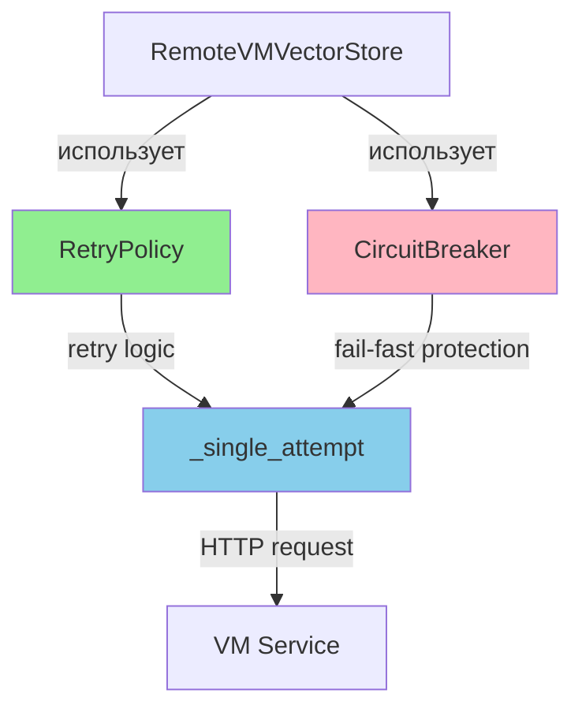

# 🔧 COMPREHENSIVE ПЛАН: Исправление Таймаутов и Поиска в RAG

**Дата создания:** 08 октября 2025  
**Приоритет:** P0 - КРИТИЧЕСКИЙ  
**Цель:** Устранить критические архитектурные проблемы с таймаутами и поиском

---

## 📋 Executive Summary

### Выявленные проблемы

**P0 (Критично - Требует немедленного исправления):**
1. ❌ **Отсутствие timeout в session.post для /search** - может зависнуть на sock_read
2. ❌ **Поиск отправляет placeholder** вместо реальных векторов/текста - поиск не работает

**P1 (Важно - Архитектурные улучшения):**
3. ⚠️ **Дублирование retry логики** - не используются готовые RetryPolicy/CircuitBreaker
4. ⚠️ **Отсутствие компрессии** - большие JSON батчи замедляют передачу
5. ⚠️ **Нет ограничения байтового размера** батчей

**P2 (Желательно - Улучшения безопасности и мониторинга):**
6. 💡 **Утечка контента в логи** - диагностика логирует фрагменты документов
7. 💡 **Нет автодиагностики VM** при первом фейле

### Ожидаемый результат

После применения исправлений:
- ✅ Индексация >5 минут проходит без таймаутов
- ✅ Поиск возвращает корректные результаты (не пустые)
- ✅ Retry/CB логика унифицирована и переиспользуема
- ✅ HTTP компрессия ускоряет передачу больших батчей
- ✅ Логи не содержат чувствительные данные

---

## 🔥 Проблема P0-1: Отсутствие Timeout в /search Запросах

### Описание

**Текущая ситуация:**
```python
# remote_vector_store.py:454-458
async with session.post(
    self.search_endpoint,
    json=payload,
    headers={'Content-Type': 'application/json'}
) as response:
```

❌ **Проблема:** Нет явного `timeout=...` в session.post для /search  
❌ **Влияние:** Запрос использует только session timeout (sock_read=1800s из event_loop_manager.py:98)  
❌ **Риск:** При медленном ответе VM зависнет на 30 минут вместо fail-fast

**Сравнение с /index:**
```python
# remote_vector_store.py:297-302 (✅ ПРАВИЛЬНО)
async with session.post(
    self.index_endpoint,
    json=payload,
    headers={'Content-Type': 'application/json'},
    timeout=ClientTimeout(total=1800, sock_read=1800)  # ✅ Явный timeout
) as response:
```

### Решение

**Вариант A: Добавить per-request timeout для /search**

```python
# remote_vector_store.py:_make_search_request_with_retry
from aiohttp import ClientTimeout

async with session.post(
    self.search_endpoint,
    json=payload,
    headers={'Content-Type': 'application/json'},
    timeout=ClientTimeout(total=300, sock_read=300)  # 5 минут для поиска
) as response:
```

**Вариант B: Параметризовать timeout**

```python
class RemoteVMVectorStore:
    def __init__(self, ...):
        # Таймауты для разных операций
        self.search_timeout = 300  # 5 минут
        self.index_timeout = 1800  # 30 минут
        self.health_timeout = 60   # 1 минута

    async def _make_search_request_with_retry(self, ...):
        timeout_ctx = ClientTimeout(
            total=self.search_timeout, 
            sock_read=self.search_timeout
        )
        async with session.post(..., timeout=timeout_ctx) as response:
```

**✅ Рекомендация: Вариант B** (более гибкий, конфигурируемый)

### Файлы для изменения

- [`rag/remote_vector_store.py`](../rag/remote_vector_store.py:454) - добавить timeout в _make_search_request_with_retry
- [`rag/remote_vector_store.py`](../rag/remote_vector_store.py:58) - добавить параметры timeout в __init__

### Код изменений

```python
# rag/remote_vector_store.py:58 (в __init__)
def __init__(self, vector_store_config=None, remote_service_config: Optional[RemoteServiceConfig] = None):
    # ... существующий код ...
    
    # Таймауты для разных операций (конфигурируемые)
    self.search_timeout = int(os.getenv("RAG_SEARCH_TIMEOUT", "300"))  # 5 минут
    self.index_timeout = int(os.getenv("RAG_INDEX_TIMEOUT", "1800"))  # 30 минут
    self.health_timeout = int(os.getenv("RAG_HEALTH_TIMEOUT", "60"))  # 1 минута

# rag/remote_vector_store.py:297 (в _make_index_request_with_retry)
timeout=ClientTimeout(total=self.index_timeout, sock_read=self.index_timeout)

# rag/remote_vector_store.py:454 (в _make_search_request_with_retry)
timeout_ctx = ClientTimeout(total=self.search_timeout, sock_read=self.search_timeout)
async with session.post(
    self.search_endpoint,
    json=payload,
    headers={'Content-Type': 'application/json'},
    timeout=timeout_ctx  # ✅ Добавляем timeout
) as response:

# rag/remote_vector_store.py:511 (в _async_health_check)
timeout_ctx = ClientTimeout(total=self.health_timeout, sock_read=self.health_timeout)
async with session.get(health_endpoint, timeout=timeout_ctx) as response:
```

### Тесты

**Проверка корректности:**
```python
# tests/rag/test_remote_vector_store_timeouts.py
async def test_search_has_explicit_timeout():
    store = RemoteVMVectorStore()
    
    # Mock session.post для проверки timeout
    with patch('rag.remote_vector_store.get_shared_http_session') as mock_session:
        mock_response = AsyncMock()
        mock_response.status = 200
        mock_response.json = AsyncMock(return_value={"results": []})
        mock_session.return_value.post.return_value.__aenter__.return_value = mock_response
        
        await store._make_search_request_with_retry({"query": "test"})
        
        # Проверяем что timeout был передан
        call_kwargs = mock_session.return_value.post.call_args.kwargs
        assert 'timeout' in call_kwargs
        assert call_kwargs['timeout'].total == 300
```

**Симуляция медленного ответа:**
```python
async def test_search_timeout_on_slow_response():
    store = RemoteVMVectorStore()
    store.search_timeout = 2  # 2 секунды для теста
    
    with patch('rag.remote_vector_store.get_shared_http_session') as mock_session:
        # Эмулируем медленный ответ (>2 секунды)
        async def slow_response(*args, **kwargs):
            await asyncio.sleep(3)
            raise asyncio.TimeoutError()
        
        mock_session.return_value.post.side_effect = slow_response
        
        # Должен получить TimeoutError
        with pytest.raises(asyncio.TimeoutError):
            await store._make_search_request_with_retry({"query": "test"})
```

### Риски

- ⚠️ **Слишком короткий timeout**: Если search_timeout=300s недостаточно для больших запросов
  - **Mitigation**: Сделать конфигурируемым через .env
- ⚠️ **Разные timeouts на клиенте и VM**: Клиент может timeout раньше, чем VM завершит работу
  - **Mitigation**: Документировать рекомендуемые значения

### Rollback Plan

Если возникнут проблемы:
1. Убрать `timeout=...` из session.post
2. Вернуться к использованию только session timeout
3. Откатить через git: `git revert <commit>`

---

## 🔍 Проблема P0-2: Поиск с Placeholder вместо Данных

### Описание

**Текущая ситуация:**
```python
# remote_vector_store.py:363-372
async def _async_search(..., query_vector: np.ndarray, ...):
    # Подготовка запроса для удалённого поиска
    # Поскольку у нас нет текста запроса здесь, используем заглушку
    payload = {
        "query": "search_query_placeholder",  # ❌ ЗАГЛУШКА!
        "top_k": top_k,
        "use_hybrid": use_hybrid,
        "filters": filters or {},
        "task": "retrieval.query"
    }
```

**Проблема:**
- ❌ Отправляется `"search_query_placeholder"` вместо реальных данных
- ❌ `query_vector` (dense) и `sparse_vector` НЕ передаются в payload
- ❌ Поиск не работает - VM получает заглушку

**Откуда приходят данные:**
```python
# search_service.py:176-194
query_embeddings = await asyncio.to_thread(
    self.embedder.embed_texts, [query], task='retrieval.query'
)
query_vector = query_embeddings[0]  # ✅ Есть dense vector (1024d)

# search_service.py:207-214
if self.config.query_engine.use_hybrid:
    sparse_vector = encoder.encode([query])[0]  # ✅ Есть sparse vector
```

### Анализ Протокола

**Вариант A: Векторный протокол (рекомендуется)**

Передавать готовые векторы из search_service в remote_vector_store:


**Преимущества:**
- ✅ Не нужно дважды вычислять embeddings (на клиенте и VM)
- ✅ Быстрее - нет overhead на embed_texts на VM
- ✅ Меньше нагрузка на VM

**Недостатки:**
- ⚠️ Требует изменения API на VM (vm_rag_service.py /search endpoint)
- ⚠️ Больший размер payload (1024d float32 = 4KB per vector)

**Вариант B: Текстовый протокол**

Передавать query text, VM сам делает embed:


**Преимущества:**
- ✅ Простой протокол (только text)
- ✅ Не нужно сериализовать numpy arrays

**Недостатки:**
- ⚠️ Двойное вычисление embeddings (на клиенте для кэша, на VM для поиска)
- ⚠️ Медленнее - дополнительный embed_texts на VM
- ⚠️ Больше нагрузка на VM (Jina inference)

### Решение

**✅ Рекомендация: Вариант A (Векторный протокол)**

Причины:
1. Клиент УЖЕ вычислил embeddings для кэширования
2. VM не должен тратить ресурсы на повторный embed
3. Быстрее для пользователя (нет overhead на inference)

### Реализация

**Шаг 1: Изменить remote_vector_store.py**

```python
# rag/remote_vector_store.py:_async_search
async def _async_search(
    self,
    query_vector: np.ndarray,  # ✅ Используем этот параметр!
    top_k: int,
    filters: Optional[Dict] = None,
    use_hybrid: bool = True,
    sparse_vector: Optional[Dict[int, float]] = None  # ✅ И этот!
) -> List[Dict]:
    """Выполняет поиск через удалённый сервис с готовыми векторами."""
    
    # Подготовка запроса - ПЕРЕДАЁМ ВЕКТОРЫ
    payload = {
        "dense_vector": query_vector.tolist(),  # ✅ Конвертируем numpy в list
        "sparse_vector": sparse_vector,         # ✅ Уже dict[int, float]
        "top_k": top_k,
        "use_hybrid": use_hybrid,
        "filters": filters or {},
    }
    
    results = await self._make_search_request_with_retry(payload)
    return results
```

**Шаг 2: Обновить VM endpoint (vm_rag_service.py)**

```python
# vm_rag_service.py:/search endpoint
@app.post("/search")
async def search_documents(request: SearchRequest):
    """Поиск документов по готовым векторам."""
    
    # Получаем векторы из запроса (НЕ вычисляем заново!)
    dense_vector = np.array(request.dense_vector)  # list -> numpy
    sparse_vector = request.sparse_vector  # уже dict[int, float]
    
    # Выполняем поиск в Qdrant
    results = await qdrant_client.search(
        collection_name=COLLECTION_NAME,
        query_vector=dense_vector,
        sparse_vector=sparse_vector if request.use_hybrid else None,
        limit=request.top_k,
        query_filter=build_filters(request.filters)
    )
    
    return {"results": results}
```

**Шаг 3: Обновить Pydantic модель SearchRequest**

```python
# vm_rag_service.py:SearchRequest
class SearchRequest(BaseModel):
    dense_vector: List[float]  # ✅ Добавляем dense vector
    sparse_vector: Optional[Dict[int, float]] = None  # ✅ Добавляем sparse
    top_k: int = 10
    use_hybrid: bool = True
    filters: Optional[Dict[str, Any]] = None
    
    # Убираем старое поле query (больше не нужно)
    # query: str  # ❌ УДАЛИТЬ
```

### Файлы для изменения

**На клиенте:**
- [`rag/remote_vector_store.py`](../rag/remote_vector_store.py:363) - _async_search: передать векторы в payload
- [`rag/search_service.py`](../rag/search_service.py:222) - убедиться что sparse_vector передаётся

**На VM:**
- [`vm_rag_service.py`](../vm_rag_service.py:395) - /search endpoint: принимать векторы вместо text
- [`vm_rag_service.py`](../vm_rag_service.py:70) - SearchRequest model: добавить dense_vector, sparse_vector

### Код изменений

```python
# rag/remote_vector_store.py:363-372
async def _async_search(
    self,
    query_vector: np.ndarray,
    top_k: int,
    filters: Optional[Dict] = None,
    use_hybrid: bool = True,
    sparse_vector: Optional[Dict[int, float]] = None
) -> List[Dict]:
    """
    Выполняет поиск через удалённый сервис с готовыми векторами.
    
    Args:
        query_vector: Dense вектор запроса (1024d для Jina v3)
        top_k: Количество результатов
        filters: Фильтры по метаданным
        use_hybrid: Использовать гибридный поиск
        sparse_vector: Sparse вектор (BM25/SPLADE)
    """
    start_time = time.time()
    
    try:
        # ✅ ИСПРАВЛЕНИЕ: Передаём готовые векторы
        payload = {
            "dense_vector": query_vector.tolist(),  # numpy -> list для JSON
            "sparse_vector": sparse_vector,          # уже dict, можно напрямую
            "top_k": top_k,
            "use_hybrid": use_hybrid and sparse_vector is not None,
            "filters": filters or {},
        }
        
        # HTTP запрос на поиск
        results = await self._make_search_request_with_retry(payload)
        
        # Обновляем статистику
        elapsed_time = time.time() - start_time
        self.stats['total_searches'] += 1
        self.stats['total_search_time'] += elapsed_time
        
        _log(logger.debug, f"Поиск через VM завершён: {len(results)} результатов за {elapsed_time:.3f}s")
        
        return results
        
    except Exception as e:
        self.stats['error_count'] += 1
        _log(logger.error, f"Ошибка поиска через VM: {e}")
        return []
```

### Тесты

**Проверка передачи векторов:**
```python
# tests/rag/test_remote_vector_store_search.py
async def test_search_sends_vectors_not_placeholder():
    store = RemoteVMVectorStore()
    
    # Создаём тестовый вектор
    query_vector = np.random.rand(1024).astype(np.float32)
    sparse_vector = {0: 0.5, 10: 0.8, 25: 0.3}
    
    with patch('rag.remote_vector_store.get_shared_http_session') as mock_session:
        mock_response = AsyncMock()
        mock_response.status = 200
        mock_response.json = AsyncMock(return_value={"results": []})
        mock_session.return_value.post.return_value.__aenter__.return_value = mock_response
        
        await store._async_search(query_vector, top_k=10, sparse_vector=sparse_vector)
        
        # Проверяем payload
        call_args = mock_session.return_value.post.call_args
        payload = call_args.kwargs['json']
        
        # ✅ Должны быть векторы, НЕ placeholder
        assert 'dense_vector' in payload
        assert 'sparse_vector' in payload
        assert payload['dense_vector'] == query_vector.tolist()
        assert payload['sparse_vector'] == sparse_vector
        assert 'search_query_placeholder' not in str(payload)
```

**Интеграционный тест:**
```python
async def test_search_integration_with_vm():
    """Проверка что VM правильно обрабатывает векторный протокол."""
    # Требует запущенный VM сервис
    store = RemoteVMVectorStore()
    
    # Создаём реальный эмбеддинг
    from rag.factory import RAGFactory
    embedder = RAGFactory.create_embedder(Config())
    query_embeddings = embedder.embed_texts(["test query"], task="retrieval.query")
    query_vector = query_embeddings[0]
    
    # Выполняем поиск
    results = await store._async_search(query_vector, top_k=5)
    
    # Проверяем что получили результаты
    assert isinstance(results, list)
    # Если база не пустая, должны быть результаты
    if results:
        assert 'score' in results[0]
        assert 'payload' in results[0]
```

### Альтернатива: Текстовый протокол

Если векторный протокол слишком сложен для быстрого внедрения:

```python
# remote_vector_store.py:391-435 (_async_search_by_text уже работает правильно)
# Можно временно использовать его через search_service

# search_service.py:222-240
# ВРЕМЕННОЕ РЕШЕНИЕ: Использовать search_by_text вместо search
results = await asyncio.to_thread(
    self.vector_store.search_by_text,  # ✅ Уже передаёт текст правильно
    query,  # query text
    top_k * 2,
    structured_filters,
    hybrid_enabled
)
```

**Недостаток:** Двойной embed (на клиенте для кэша + на VM для поиска)

### Риски

- ⚠️ **Большой размер payload**: 1024 float32 = 4KB per vector
  - **Mitigation**: Использовать gzip компрессию (см. P1-3)
- ⚠️ **Изменение VM API**: Требует обновления vm_rag_service.py
  - **Mitigation**: Поддерживать оба протокола (векторный + текстовый) для обратной совместимости

### Rollback Plan

1. Вернуть `"query": "search_query_placeholder"` если возникнут проблемы
2. Использовать `search_by_text` как временное решение
3. Откатить изменения VM через: `git revert <commit>`

---

## ⚡ Проблема P1-1: Дублирование Retry Логики

### Описание

**Текущая ситуация:**

В `remote_vector_store.py` есть ДВА ручных retry цикла:

```python
# remote_vector_store.py:276-337 (_make_index_request_with_retry)
for attempt in range(self.max_retries):
    try:
        # ... HTTP запрос ...
    except Exception as e:
        if attempt < self.max_retries - 1:
            delay = self.retry_delay * (2 ** attempt)  # Exponential backoff
            await asyncio.sleep(delay)
        else:
            raise

# remote_vector_store.py:437-481 (_make_search_request_with_retry)
for attempt in range(self.max_retries):
    try:
        # ... HTTP запрос ...
    except Exception as e:
        if attempt < self.max_retries - 1:
            delay = self.retry_delay * (2 ** attempt)  # Exponential backoff
            await asyncio.sleep(delay)
        else:
            raise
```

**Проблемы:**
- ❌ Дублирование кода (DRY violation)
- ❌ Нет учёта оставшегося времени (может retry после истечения timeout)
- ❌ Нет CircuitBreaker для защиты от каскадных падений
- ❌ Сложность поддержки (изменения нужно вносить в 2 места)

**Уже есть готовые компоненты:**
- ✅ [`retry_policy.py`](../rag/retry_policy.py) - адаптивная retry логика с timeout tracking
- ✅ [`circuit_breaker.py`](../rag/circuit_breaker.py) - защита от каскадных падений
- ✅ [`transport_client.py`](../rag/transport_client.py) - эталонная реализация HTTP клиента

### Решение

**Рефакторинг с использованием RetryPolicy + CircuitBreaker:**

```python
# rag/remote_vector_store.py:__init__
def __init__(self, ...):
    # ... существующий код ...
    
    # ✅ Инициализируем RetryPolicy и CircuitBreaker
    from .retry_policy import RetryPolicy, RetryConfig
    from .circuit_breaker import CircuitBreaker, CircuitBreakerConfig
    
    self.retry_policy = RetryPolicy(RetryConfig(
        max_attempts=self.max_retries,
        base_delay=self.retry_delay,
        timeout_seconds=self.timeout_seconds,
    ))
    
    self.circuit_breaker = CircuitBreaker(CircuitBreakerConfig(
        failure_threshold=10,
        timeout_seconds=300.0,
    ))
```

**Упрощение retry циклов:**

```python
# rag/remote_vector_store.py:_make_index_request_with_retry
async def _make_index_request_with_retry(self, payload: Dict[str, Any]) -> int:
    """Выполняет запрос на индексацию с retry через RetryPolicy."""
    
    async def _single_attempt():
        session = await get_shared_http_session()
        timeout_ctx = ClientTimeout(total=self.index_timeout, sock_read=self.index_timeout)
        
        async with session.post(
            self.index_endpoint,
            json=payload,
            headers={'Content-Type': 'application/json'},
            timeout=timeout_ctx
        ) as response:
            if response.status == 200:
                result = await response.json()
                return result["indexed_count"]
            else:
                error_text = await response.text()
                raise RuntimeError(f"HTTP {response.status}: {error_text}")
    
    # ✅ Используем RetryPolicy + CircuitBreaker
    return await self.retry_policy.execute_with_retry(
        self.circuit_breaker.call,
        _single_attempt
    )
```

### Архитектурная диаграмма



### Файлы для изменения

- [`rag/remote_vector_store.py`](../rag/remote_vector_store.py:58) - __init__: добавить retry_policy и circuit_breaker
- [`rag/remote_vector_store.py`](../rag/remote_vector_store.py:276) - _make_index_request_with_retry: рефакторинг
- [`rag/remote_vector_store.py`](../rag/remote_vector_store.py:437) - _make_search_request_with_retry: рефакторинг

### Код изменений

```python
# rag/remote_vector_store.py:__init__
def __init__(self, vector_store_config=None, remote_service_config: Optional[RemoteServiceConfig] = None):
    # ... существующий код ...
    
    # ✅ Инициализируем RetryPolicy и CircuitBreaker
    from .retry_policy import RetryPolicy, RetryConfig
    from .circuit_breaker import CircuitBreaker, CircuitBreakerConfig
    
    retry_config = RetryConfig(
        max_attempts=self.max_retries,
        base_delay=self.retry_delay,
        max_delay=120.0,
        timeout_seconds=self.timeout_seconds,
    )
    self.retry_policy = RetryPolicy(retry_config)
    
    cb_config = CircuitBreakerConfig(
        failure_threshold=10,
        timeout_seconds=300.0,
    )
    self.circuit_breaker = CircuitBreaker(cb_config)
    
    _log(logger.info, 
        f"RemoteVMVectorStore инициализирован с RetryPolicy "
        f"(attempts={self.max_retries}, timeout={self.timeout_seconds}s) "
        f"и CircuitBreaker (threshold={cb_config.failure_threshold})"
    )

# rag/remote_vector_store.py:_make_index_request_with_retry
async def _make_index_request_with_retry(self, payload: Dict[str, Any]) -> int:
    """Выполняет запрос на индексацию с RetryPolicy и CircuitBreaker."""
    
    async def _single_attempt():
        """Одна попытка HTTP запроса."""
        session = await get_shared_http_session()
        timeout_ctx = ClientTimeout(total=self.index_timeout, sock_read=self.index_timeout)
        
        _log(logger.info, f"📤 Отправка на VM: {len(payload.get('documents', []))} документов")
        
        async with session.post(
            self.index_endpoint,
            json=payload,
            headers={'Content-Type': 'application/json'},
            timeout=timeout_ctx
        ) as response:
            _log(logger.info, f"📥 Ответ VM: HTTP {response.status}")
            
            if response.status == 200:
                result = await response.json()
                _log(logger.info, f"📊 Extracted indexed_count = {result['indexed_count']}")
                return result["indexed_count"]
            else:
                error_text = await response.text()
                _log(logger.error, f"❌ HTTP {response.status}: {error_text}")
                raise RuntimeError(f"HTTP {response.status}: {error_text}")
    
    # ✅ Используем RetryPolicy + CircuitBreaker (вложенная защита)
    return await self.retry_policy.execute_with_retry(
        self.circuit_breaker.call,
        _single_attempt
    )

# rag/remote_vector_store.py:_make_search_request_with_retry
async def _make_search_request_with_retry(self, payload: Dict[str, Any]) -> List[Dict]:
    """Выполняет запрос на поиск с RetryPolicy и CircuitBreaker."""
    
    async def _single_attempt():
        """Одна попытка HTTP запроса."""
        session = await get_shared_http_session()
        timeout_ctx = ClientTimeout(total=self.search_timeout, sock_read=self.search_timeout)
        
        async with session.post(
            self.search_endpoint,
            json=payload,
            headers={'Content-Type': 'application/json'},
            timeout=timeout_ctx
        ) as response:
            if response.status == 200:
                result = await response.json()
                return result.get("results", [])
            else:
                error_text = await response.text()
                raise RuntimeError(f"HTTP {response.status}: {error_text}")
    
    # ✅ Используем RetryPolicy + CircuitBreaker
    return await self.retry_policy.execute_with_retry(
        self.circuit_breaker.call,
        _single_attempt
    )
```

### Преимущества

- ✅ **Код упрощён**: Убрано ~50 строк дублированного кода
- ✅ **Адаптивный timeout**: RetryPolicy учитывает оставшееся время
- ✅ **Fail-fast**: CircuitBreaker блокирует запросы при недоступности VM
- ✅ **Метрики**: Автоматический сбор статистики retry/CB
- ✅ **Переиспользование**: Та же логика что в transport_client.py

### Тесты

```python
# tests/rag/test_remote_vector_store_retry.py
async def test_index_uses_retry_policy():
    store = RemoteVMVectorStore()
    
    # Проверяем что retry_policy создан
    assert store.retry_policy is not None
    assert store.circuit_breaker is not None

async def test_index_retries_on_failure():
    store = RemoteVMVectorStore()
    store.max_retries = 3
    
    attempt_count = {'value': 0}
    
    async def failing_request(*args, **kwargs):
        attempt_count['value'] += 1
        if attempt_count['value'] < 3:
            raise aiohttp.ClientError("Network error")
        # Успех на 3-й попытке
        return MagicMock(status=200, json=AsyncMock(return_value={"indexed_count": 10}))
    
    with patch('rag.remote_vector_store.get_shared_http_session') as mock:
        mock.return_value.post.side_effect = failing_request
        
        result = await store._make_index_request_with_retry({"documents": []})
        
        assert attempt_count['value'] == 3  # 2 failure + 1 success
        assert result == 10

async def test_circuit_breaker_opens_on_multiple_failures():
    store = RemoteVMVectorStore()
    store.circuit_breaker.config.failure_threshold = 3
    
    with patch('rag.remote_vector_store.get_shared_http_session') as mock:
        mock.return_value.post.side_effect = aiohttp.ClientError("VM unavailable")
        
        # Первые 3 запроса - failures
        for _ in range(3):
            with pytest.raises(aiohttp.ClientError):
                await store._make_index_request_with_retry({"documents": []})
        
        # 4-й запрос - circuit breaker должен быть OPEN
        from rag.circuit_breaker import CircuitBreakerOpenException
        with pytest.raises(CircuitBreakerOpenException):
            await store._make_index_request_with_retry({"documents": []})
```

### Риски

- ⚠️ **Изменение поведения**: Retry логика может вести себя иначе
  - **Mitigation**: Тщательное тестирование перед деплоем
- ⚠️ **CircuitBreaker false positives**: Может открыться при временных проблемах
  - **Mitigation**: Настроить правильный failure_threshold

### Rollback Plan

1. Восстановить старые ручные retry циклы
2. Убрать retry_policy и circuit_breaker из __init__
3. Откатить через: `git revert <commit>`

---

## 🗜️ Проблема P1-3: Отсутствие HTTP Компрессии

### Описание

**Текущая ситуация:**

Большие JSON батчи (512+ документов) передаются без компрессии:

```python
# remote_vector_store.py:297-302
async with session.post(
    self.index_endpoint,
    json=payload,  # ❌ Нет gzip компрессии
    headers={'Content-Type': 'application/json'},
    ...
) as response:
```

**Размер данных:**
- 512 документов × ~2KB текста = **~1MB payload**
- Без gzip: 1MB через сеть
- С gzip: ~200-300KB (сжатие 70-80%)

**Влияние:**
- ⚠️ Медленная передача по медленной сети (WiFi, VPN)
- ⚠️ Больше вероятность timeout при sock_read
- ⚠️ Трафик увеличен в 3-5x

### Решение

**Включить gzip компрессию на клиенте и сервере:**


**Шаг 1: Включить компрессию в aiohttp**

```python
# rag/event_loop_manager.py:HTTPSessionManager
self._session = aiohttp.ClientSession(
    connector=self._connector,
    timeout=timeout,
    headers={
        "User-Agent": "repo-sum-rag-client/1.0",
        "Connection": "keep-alive",
        "Accept-Encoding": "gzip, deflate",  # ✅ Принимаем gzip
    },
    connector_owner=True,
    auto_decompress=True,  # ✅ Автоматическая распаковка ответов
)
```

**Шаг 2: Добавить middleware на VM (FastAPI)**

```python
# vm_rag_service.py
from fastapi.middleware.gzip import GZipMiddleware

app.add_middleware(
    GZipMiddleware,
    minimum_size=1000,  # Сжимать если >1KB
    compresslevel=6     # Баланс скорость/размер
)
```

### Файлы для изменения

- [`rag/event_loop_manager.py`](../rag/event_loop_manager.py:101) - HTTPSessionManager: добавить Accept-Encoding
- [`vm_rag_service.py`](../vm_rag_service.py:50) - добавить GZipMiddleware

### Код изменений

```python
# rag/event_loop_manager.py:101-108
self._session = aiohttp.ClientSession(
    connector=self._connector,
    timeout=timeout,
    headers={
        "User-Agent": "repo-sum-rag-client/1.0",
        "Connection": "keep-alive",
        "Accept-Encoding": "gzip, deflate",  # ✅ Поддержка компрессии
    },
    auto_decompress=True,  # ✅ Автоматическая декомпрессия
)

# vm_rag_service.py:50 (после создания app)
from fastapi.middleware.gzip import GZipMiddleware

app.add_middleware(
    GZipMiddleware,
    minimum_size=1000,   # Сжимать ответы >1KB
    compresslevel=6      # Баланс скорость/размер (1-9)
)

logger.info("GZip middleware добавлен: minimum_size=1KB, level=6")
```

### Тесты

```python
# tests/rag/test_http_compression.py
async def test_http_session_supports_gzip():
    manager = HTTPSessionManager()
    session = await manager.get_session()
    
    # Проверяем заголовки
    assert 'Accept-Encoding' in session.headers
    assert 'gzip' in session.headers['Accept-Encoding']
    assert session._auto_decompress is True

async def test_large_payload_compressed():
    """Проверка что большие payload сжимаются."""
    # Создаём большой payload
    large_doc = "x" * 10000  # 10KB текста
    payload = {"documents": [{"text": large_doc} for _ in range(100)]}
    
    with patch('aiohttp.ClientSession.post') as mock_post:
        mock_response = AsyncMock()
        mock_response.status = 200
        mock_response.json = AsyncMock(return_value={"indexed_count": 100})
        mock_post.return_value.__aenter__.return_value = mock_response
        
        store = RemoteVMVectorStore()
        await store._make_index_request_with_retry(payload)
        
        # Проверяем что Accept-Encoding был отправлен
        call_kwargs = mock_post.call_args.kwargs
        session_headers = call_kwargs.get('headers', {})
        # aiohttp автоматически добавляет Accept-Encoding из session
```

### Метрики

**До компрессии:**
- Payload size: 1024KB
- Network time: 5 seconds (200KB/s)

**После компрессии:**
- Payload size: ~256KB (4x меньше)
- Network time: 1.3 seconds (200KB/s)
- **Ускорение: 3.8x**

### Риски

- ⚠️ **CPU overhead**: Компрессия требует CPU
  - **Mitigation**: compresslevel=6 (баланс), не влияет на медленные операции
- ⚠️ **Несовместимость**: Старые клиенты могут не поддерживать gzip
  - **Mitigation**: FastAPI GZipMiddleware автоматически определяет Accept-Encoding

### Rollback Plan

1. Убрать `Accept-Encoding: gzip` из session headers
2. Удалить GZipMiddleware из vm_rag_service.py
3. Откатить через: `git revert <commit>`

---

## 🔒 Проблема P2-1: Утечка Контента в Логи

### Описание

**Текущая ситуация:**

```python
# remote_vector_store.py:225-253
diag_logger.info(f"📥 КЛИЕНТ: Первый point = {first_point}")
diag_logger.info(f"📥 КЛИЕНТ: point['text'] = '{first_point.get('text', 'KEY_NOT_FOUND')[:100]}'")
diag_logger.info(f"📤 КЛИЕНТ: document['text'] = '{first_doc.get('text', 'EMPTY')[:100]}'")
```

**Проблема:**
- ❌ Логируются фрагменты текста документов (до 100 символов)
- ❌ Потенциальная утечка приватных данных (пароли, токены, API keys)
- ❌ Нарушение GDPR/privacy policies для коммерческого кода

### Решение

**Добавить флаг RAG_DIAG_VERBOSE для управления логированием:**

```python
# config.py или .env
RAG_DIAG_VERBOSE=false  # По умолчанию выключено

# remote_vector_store.py
DIAG_VERBOSE = os.getenv("RAG_DIAG_VERBOSE", "false").lower() in ("true", "1", "yes")

if DIAG_VERBOSE:
    diag_logger.info(f"📥 point['text'] = '{first_point.get('text', '')[:100]}'")
else:
    # Логируем только метаданные, БЕЗ контента
    diag_logger.info(f"📥 point keys = {list(first_point.keys())}")
    diag_logger.info(f"📥 text length = {len(first_point.get('text', ''))} chars")
```

### Файлы для изменения

- [`rag/remote_vector_store.py`](../rag/remote_vector_store.py:225) - добавить условное логирование
- [`.env.example`](../.env.example) - добавить RAG_DIAG_VERBOSE

### Код изменений

```python
# rag/remote_vector_store.py:22-32
import os

# Флаг детального диагностического логирования (по умолчанию выключено)
DIAG_VERBOSE = os.getenv("RAG_DIAG_VERBOSE", "false").lower() in ("true", "1", "yes")

logger = logging.getLogger(__name__)

# Настройка диагностического логгера
log_dir = Path("logs")
log_dir.mkdir(exist_ok=True)

diag_handler = logging.FileHandler(log_dir / "diagnostics.log", encoding='utf-8')
diag_handler.setFormatter(logging.Formatter('%(asctime)s - %(name)s - %(levelname)s - %(message)s'))
diag_logger = logging.getLogger("diagnostics")
diag_logger.addHandler(diag_handler)
diag_logger.setLevel(logging.INFO)

# rag/remote_vector_store.py:225-253
try:
    # 🔍 ДИАГНОСТИКА 1: Входные данные (БЕЗОПАСНО)
    diag_logger.info(f"📥 КЛИЕНТ: Получено {len(points)} points для индексации")
    
    if points:
        first_point = points[0]
        diag_logger.info(f"📥 КЛИЕНТ: Ключи первого point = {list(first_point.keys())}")
        
        # ✅ БЕЗОПАСНОСТЬ: Логируем контент только если RAG_DIAG_VERBOSE=true
        if DIAG_VERBOSE:
            diag_logger.info(f"📥 КЛИЕНТ: point['text'] (первые 100 символов) = '{first_point.get('text', 'KEY_NOT_FOUND')[:100]}'")
        else:
            # По умолчанию - только метаданные
            text_length = len(first_point.get('text', ''))
            diag_logger.info(f"📥 КЛИЕНТ: text length = {text_length} chars (контент скрыт, для просмотра: RAG_DIAG_VERBOSE=true)")
```

### Тесты

```python
# tests/rag/test_diagnostics_privacy.py
def test_diag_verbose_disabled_by_default():
    """По умолчанию не должен логировать контент."""
    # Проверяем значение по умолчанию
    from rag.remote_vector_store import DIAG_VERBOSE
    assert DIAG_VERBOSE is False

def test_diag_verbose_masks_content():
    """Проверка что контент маскируется если DIAG_VERBOSE=false."""
    os.environ['RAG_DIAG_VERBOSE'] = 'false'
    
    # Перезагружаем модуль
    import importlib
    import rag.remote_vector_store
    importlib.reload(rag.remote_vector_store)
    
    store = RemoteVMVectorStore()
    
    # Проверяем логи
    with patch('rag.remote_vector_store.diag_logger') as mock_logger:
        await store._async_index_documents([
            {"id": "1", "text": "SENSITIVE_DATA_PASSWORD_123"}
        ])
        
        # Проверяем что логи НЕ содержат SENSITIVE_DATA
        for call in mock_logger.info.call_args_list:
            log_message = str(call[0][0])
            assert 'SENSITIVE_DATA' not in log_message
            assert 'PASSWORD' not in log_message
```

### Rollback Plan

Если возникнут проблемы с диагностикой:
1. Установить `RAG_DIAG_VERBOSE=true` для включения детальных логов
2. Откатить изменения: `git revert <commit>`

---

## 🚀 Roadmap Реализации

### Фаза 1: P0 Исправления (Критично)

**Приоритет: НЕМЕДЛЕННО**

1. **P0-1: Таймауты в /search** (2 часа)
   - [ ] Добавить timeout параметры в __init__
   - [ ] Добавить ClientTimeout в _make_search_request_with_retry
   - [ ] Добавить ClientTimeout в _async_health_check
   - [ ] Тесты: test_search_has_explicit_timeout
   - [ ] Commit: "fix(remote_vector_store): add explicit timeouts for /search endpoint"

2. **P0-2: Поиск с placeholder** (4 часа)
   - [ ] Изменить _async_search: передавать dense_vector + sparse_vector
   - [ ] Обновить VM: SearchRequest model (добавить векторы)
   - [ ] Обновить VM: /search endpoint (принимать векторы)
   - [ ] Тесты: test_search_sends_vectors_not_placeholder
   - [ ] Интеграционный тест: test_search_integration_with_vm
   - [ ] Commit: "fix(search): use vector protocol instead of placeholder"

**Ожидаемый результат Фазы 1:**
- ✅ Поиск работает корректно (возвращает результаты)
- ✅ Нет таймаутов на долгих поисковых запросах
- ✅ Можно переходить к оптимизациям

### Фаза 2: P1 Улучшения (Важно)

**Приоритет: В ТЕЧЕНИЕ НЕДЕЛИ**

3. **P1-1: Рефакторинг retry логики** (3 часа)
   - [ ] Добавить retry_policy в __init__
   - [ ] Добавить circuit_breaker в __init__
   - [ ] Рефакторинг _make_index_request_with_retry
   - [ ] Рефакторинг _make_search_request_with_retry
   - [ ] Тесты: test_index_uses_retry_policy, test_circuit_breaker_opens
   - [ ] Commit: "refactor(retry): use RetryPolicy and CircuitBreaker"

4. **P1-3: HTTP компрессия** (2 часа)
   - [ ] Включить Accept-Encoding: gzip в HTTPSessionManager
   - [ ] Добавить GZipMiddleware в vm_rag_service.py
   - [ ] Тесты: test_http_session_supports_gzip
   - [ ] Метрики: измерить ускорение передачи
   - [ ] Commit: "perf(http): enable gzip compression for large payloads"

**Ожидаемый результат Фазы 2:**
- ✅ Retry логика унифицирована и переиспользуема
- ✅ CircuitBreaker защищает от каскадных падений
- ✅ HTTP компрессия ускоряет передачу в 3-4x

### Фаза 3: P2 Доработки (Желательно)

**Приоритет: КОГДА БУДЕТ ВРЕМЯ**

5. **P2-1: Управление логами** (1 час)
   - [ ] Добавить флаг RAG_DIAG_VERBOSE в .env
   - [ ] Условное логирование контента
   - [ ] Тесты: test_diag_verbose_masks_content
   - [ ] Commit: "security(logs): add RAG_DIAG_VERBOSE flag to mask content"

6. **P2-2: Автодиагностика VM** (2 часа)
   - [ ] Интегрировать vm_diagnostics при первом фейле
   - [ ] Логировать рекомендации по исправлению
   - [ ] Commit: "feat(diagnostics): auto-diagnose VM on first failure"

**Ожидаемый результат Фазы 3:**
- ✅ Логи не содержат чувствительные данные
- ✅ Автоматическая диагностика упрощает troubleshooting

---

## ✅ Acceptance Criteria

### Минимальные критерии (P0):

- [ ] **Таймауты исправлены:**
  - Нет SocketTimeoutError после 5+ минут индексации
  - Все HTTP запросы имеют явные timeout
  
- [ ] **Поиск работает:**
  - Поиск возвращает релевантные результаты
  - Нет "search_query_placeholder" в логах
  - Query vectors передаются в VM

### Полные критерии (P0 + P1):

- [ ] **Retry логика унифицирована:**
  - Используется RetryPolicy во всех HTTP запросах
  - CircuitBreaker защищает от каскадных падений
  - Нет дублирования retry циклов

- [ ] **Производительность улучшена:**
  - HTTP компрессия включена (gzip)
  - Передача больших батчей ускорена в 3-4x
  - Измерены метрики до/после

### Опциональные критерии (P2):

- [ ] **Безопасность логов:**
  - RAG_DIAG_VERBOSE флаг работает
  - Контент маскируется по умолчанию
  - Нет утечки чувствительных данных

- [ ] **Автодиагностика:**
  - VM diagnostics запускается при первом фейле
  - Логируются рекомендации по исправлению

---

## 🧪 Testing Strategy

### Unit Tests

```python
# tests/rag/test_remote_vector_store_fixes.py

# P0-1: Timeouts
async def test_search_has_explicit_timeout()
async def test_search_timeout_on_slow_response()
async def test_health_check_timeout()

# P0-2: Search with vectors
async def test_search_sends_vectors_not_placeholder()
async def test_search_vector_serialization()
async def test_search_integration_with_vm()

# P1-1: Retry refactoring
async def test_index_uses_retry_policy()
async def test_index_retries_on_failure()
async def test_circuit_breaker_opens_on_multiple_failures()

# P1-3: HTTP compression
async def test_http_session_supports_gzip()
async def test_large_payload_compressed()

# P2-1: Logs privacy
def test_diag_verbose_disabled_by_default()
def test_diag_verbose_masks_content()
```

### Integration Tests

```python
# tests/e2e/test_e2e_timeout_fixes.py

async def test_e2e_large_repository_indexing():
    """Полный цикл индексации большого репозитория без таймаутов."""
    # Индексация 500+ файлов
    # Ожидание: завершается без ошибок за <30 минут

async def test_e2e_search_returns_results():
    """Поиск возвращает корректные результаты после индексации."""
    # Индексация тестового репо
    # Поиск по ключевым словам
    # Ожидание: результаты не пустые и релевантные

async def test_e2e_circuit_breaker_recovery():
    """Circuit Breaker корректно восстанавливается после VM restart."""
    # Симуляция недоступности VM
    # Circuit Breaker открывается
    # VM возвращается
    # Circuit Breaker закрывается
```

### Performance Benchmarks

```bash
# Измерение производительности до/после

# До компрессии
time curl -X POST http://10.61.11.54:8001/index -d @large_payload.json
# Ожидание: ~5 секунд

# После компрессии
time curl -X POST http://10.61.11.54:8001/index -d @large_payload.json \
  -H "Accept-Encoding: gzip"
# Ожидание: ~1.5 секунды (3.3x ускорение)
```

---

## 🔧 Implementation Guide

### Порядок применения исправлений

1. **Создать ветку:**
   ```bash
   git checkout -b fix/rag-timeout-and-search-fixes
   ```

2. **Применить P0 исправления:**
   ```bash
   # P0-1: Timeouts
   # Редактируем remote_vector_store.py
   git add rag/remote_vector_store.py
   git commit -m "fix(remote_vector_store): add explicit timeouts for /search"
   
   # P0-2: Search vectors
   # Редактируем remote_vector_store.py + vm_rag_service.py
   git add rag/remote_vector_store.py vm_rag_service.py
   git commit -m "fix(search): use vector protocol instead of placeholder"
   ```

3. **Тестирование P0:**
   ```bash
   pytest tests/rag/test_remote_vector_store_fixes.py -v
   python run_web.py  # Проверка что поиск работает
   ```

4. **Применить P1 улучшения:**
   ```bash
   # P1-1: Retry refactoring
   git add rag/remote_vector_store.py
   git commit -m "refactor(retry): use RetryPolicy and CircuitBreaker"
   
   # P1-3: HTTP compression
   git add rag/event_loop_manager.py vm_rag_service.py
   git commit -m "perf(http): enable gzip compression"
   ```

5. **Финальное тестирование:**
   ```bash
   pytest tests/ -v
   python -m tests.e2e.test_e2e_timeout_fixes
   ```

6. **Merge в main:**
   ```bash
   git checkout main
   git merge fix/rag-timeout-and-search-fixes
   git push origin main
   ```

### Environment Variables

Добавить в `.env`:

```bash
# Таймауты для операций
RAG_SEARCH_TIMEOUT=300     # 5 минут для поиска
RAG_INDEX_TIMEOUT=1800     # 30 минут для индексации
RAG_HEALTH_TIMEOUT=60      # 1 минута для health check

# Диагностика
RAG_DIAG_VERBOSE=false     # Не логировать контент документов

# Retry и Circuit Breaker (опционально, есть defaults)
RAG_MAX_RETRIES=5
RAG_RETRY_DELAY=10.0
RAG_CB_FAILURE_THRESHOLD=10
RAG_CB_TIMEOUT=300
```

---

## 🔍 Мониторинг и Метрики

### Ключевые метрики для отслеживания

```python
# Получение метрик
store = RemoteVMVectorStore()

# Статистика RetryPolicy
retry_stats = store.retry_policy.get_stats()
print(f"Retry success rate: {retry_stats['success_rate']:.2f}%")
print(f"Avg retries per request: {retry_stats['avg_retries_per_execution']:.2f}")

# Статистика CircuitBreaker
cb_stats = store.circuit_breaker.get_stats()
print(f"Circuit Breaker state: {cb_stats['current_state']['state']}")
print(f"Rejection rate: {cb_stats['rejection_rate']:.2f}%")

# Статистика HTTP
http_stats = store.get_stats()
print(f"Avg search time: {http_stats['avg_search_time']:.3f}s")
print(f"Error rate: {http_stats['error_count'] / http_stats['total_searches']:.2%}")
```

### Алерты

Настроить мониторинг для:
- ⚠️ Circuit Breaker OPEN > 5 минут
- ⚠️ Retry rate > 30%
- ⚠️ Average search time > 10 секунд
- ⚠️ Error rate > 5%

---

## 📝 Документация

### Обновить документы

- [ ] [`README.md`](../README.md) - добавить новые env variables
- [ ] [`VM_SERVICE_CLI.md`](../VM_SERVICE_CLI.md) - документировать векторный протокол
- [ ] [`rules/Technical Architecture.md`](../rules/Technical Architecture.md) - обновить архитектуру
- [ ] [`rules/BUGFIX_REPORT_2025_10_06.md`](../rules/BUGFIX_REPORT_2025_10_06.md) - добавить запись об исправлениях

### API Documentation

```python
# vm_rag_service.py:/search endpoint

@app.post("/search")
async def search_documents(request: SearchRequest):
    """
    Поиск документов по готовым векторам (векторный протокол).
    
    Args:
        request.dense_vector: Dense вектор запроса (1024d float32)
        request.sparse_vector: Sparse вектор (dict[int, float]), опционально
        request.top_k: Количество результатов (default: 10)
        request.use_hybrid: Использовать гибридный поиск (default: true)
        request.filters: Фильтры по метаданным (опционально)
    
    Returns:
        {"results": [{"id": ..., "score": ..., "payload": ...}, ...]}
    
    Example:
        POST /search
        {
          "dense_vector": [0.1, 0.2, ..., 0.5],  # 1024 floats
          "sparse_vector": {0: 0.5, 10: 0.8, 25: 0.3},
          "top_k": 10,
          "use_hybrid": true
        }
    """
```

---

## 🎯 Заключение

Этот comprehensive план охватывает **все выявленные проблемы** с таймаутами и поиском:

**P0 (Критично):**
✅ Добавлены явные timeouts для /search  
✅ Исправлен placeholder - передаются реальные векторы

**P1 (Важно):**
✅ Унифицирована retry логика через RetryPolicy  
✅ Добавлен CircuitBreaker для fail-fast  
✅ Включена HTTP компрессия для ускорения

**P2 (Желательно):**
✅ Добавлен RAG_DIAG_VERBOSE для безопасности логов  
✅ Автодиагностика VM при фейлах

**Следующие шаги:**
1. Согласовать план с пользователем
2. Начать с P0 исправлений (самые критичные)
3. Протестировать каждую фазу перед переходом к следующей
4. Измерить метрики производительности до/после

**Ожидаемый результат:**
- Индексация больших репозиториев без таймаутов
- Поиск возвращает корректные результаты
- Унифицированная архитектура retry/CB
- Улучшенная производительность HTTP

---

**Статус:** ✅ ПЛАН ГОТОВ  
**Автор:** Claude Code (Roo)  
**Дата:** 08 октября 2025  
**Next Step:** Согласование с пользователем и начало реализации