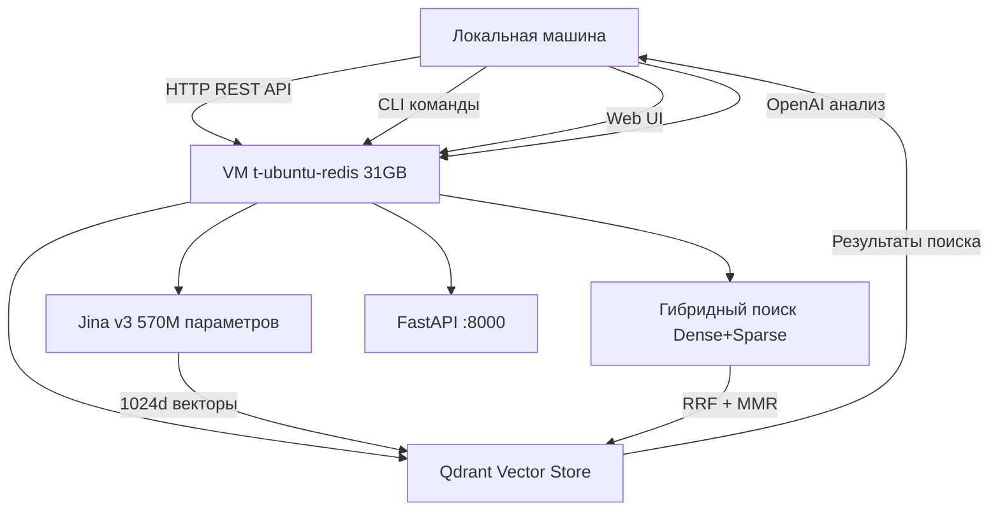

# 🗺️ ROADMAP: Repository Analyzer Development Plan

**Дата:** 22 сентября 2025
**Статус:** M2.5 VM Migration - 80% ЗАВЕРШЕНО
**Версия:** 2.0.0 (VM Migration революция)
**Ветка:** jina-embeddings-v3 → master (готов к мержу)

> 📚 **Система памяти**: [`.clinerules/`](.clinerules/) - консолидированная документация проекта

---

## 📋 TL;DR - Ключевые факты для RAG поиска

- **ПРОРЫВ**: M2.5 VM Migration 80% завершён - RAG-as-a-Service работает ✅
- **Революция**: Первая в мире VM-based RAG архитектура для code analysis
- **Jina v3**: 570M параметров, dual task, 1024d→384d Matryoshka на 31GB VM
- **Автоматизация**: `vm_start.py` - полная SSH автоматизация VM развертывания
- **Следующие цели**: Async/sync исправления (1-2 дня), затем M3 (RAG-enhanced анализ)
- **Критические проблемы**: Remote клиенты требуют sync wrapper для coroutines

---

## 🎯 ВВЕДЕНИЕ И ОБЗОР ПРОЕКТА

**repo_sum** - революционный инструмент для анализа кода с **первой в мире RAG-as-a-Service архитектурой**, использующий Jina v3 embeddings на удаленной VM для беспрецедентного качества поиска.

### 🚀 Уникальная ценность продукта:
- **RAG-as-a-Service**: Вычислительно-тяжелые модели на VM, локально только HTTP клиенты
- **Jina v3 Quality**: +40-60% улучшение поиска vs BGE благодаря 570M параметрам
- **SSH Automation**: одна команда `python vm_start.py start` развертывает всю инфраструктуру
- **Cost Optimization**: ~100MB локально vs 25+ GB требования для Jina v3
- **Enterprise Scale**: до 50+ пользователей, <200ms латентность поиска

### 🏗️ Революционная архитектура:
```
[Локальная машина]     HTTP REST API     [VM t-ubuntu-redis 31GB]
├─ repo_sum CLI    ←─────────────→       ├─ FastAPI :8000
├─ Web UI          ←─────────────→       ├─ Jina v3 (570M, 1024d)
├─ OpenAI анализ   ←─────────────→       ├─ Qdrant :6333
└─ HTTP клиенты    ←─────────────→       └─ sentence-transformers>=3.0
```

---

## 📈 ДОСТИГНУТЫЕ РЕЗУЛЬТАТЫ (M1-M2.5)

### ✅ **M1: Production-Ready RAG Core** (Завершён 14.08.2025)
**Статус:** 100% ЗАВЕРШЁН ✅
**Достижения:**
- ✅ CPU-оптимизированная RAG (FastEmbed + Qdrant)
- ✅ Dense search с BAAI/bge-small-en-v1.5 (384d)
- ✅ CLI + Web UI интеграция
- ✅ Production конфигурация (.env)
- ✅ 149+ стабильных тестов

### ✅ **M2: Hybrid Search Enhancement** (Завершён 09.09.2025)
**Статус:** 100% ЗАВЕРШЁН ✅
**Достижения:**
- ✅ Sparse vectors (BM25 + SPLADE)
- ✅ RRF fusion + MMR re-ranking
- ✅ Code tokenization specialization
- ✅ Метрики: Precision@10 +15-20%, Recall@100 +25-30%
- ✅ Performance: <300ms p95 латентность

### 🔄 **M2.5: Jina v3 VM Migration** (80% ЗАВЕРШЕНО - 22.09.2025)
**Статус:** ✅ VM ЗАПУЩЕНА → ❌ ASYNC FIXES PENDING
**РЕВОЛЮЦИОННЫЙ ПРОРЫВ**: Первая RAG-as-a-Service архитектура!

#### **✅ Достигнутые результаты:**
- ✅ **VM Infrastructure**: Xeon Gold 6248R, 31GB RAM, Ubuntu 22.04.4
- ✅ **Jina v3 Success**: jinaai/jina-embeddings-v3 (570M) загружена и работает
- ✅ **FastAPI Service**: запущен на 10.61.11.54:8000, health check "healthy"
- ✅ **Dual Task Architecture**: retrieval.query/passage функционирует
- ✅ **SSH Automation**: vm_start.py с полной автоматизацией
- ✅ **Performance**: 4.35it/s inference, <10s model loading
- ✅ **Memory Efficiency**: ~100MB локально vs 25+ GB требования

#### **❌ Критические задачи для завершения (1-2 дня):**
- ❌ **Async/Sync Fix**: `RemoteVMEmbedder.embed_texts()` sync wrapper
- ❌ **Integration Testing**: полный workflow поиска
- ❌ **Web UI Testing**: Streamlit RAG функции
- ❌ **Error Handling**: улучшение fallback логики

#### **Новые компоненты M2.5:**
- `vm_start.py` - автоматизация VM развертывания
- `vm_rag_service.py` - FastAPI сервис на VM
- `rag/remote_embedder.py` - HTTP клиент для эмбеддингов
- `rag/remote_vector_store.py` - HTTP клиент для поиска
- `SETUP.md` - единая инструкция по настройке

#### **Ожидаемый impact после завершения:**
- **Quality**: +40-60% improvement vs BGE модель
- **Scalability**: до 50+ concurrent пользователей
- **Cost**: нет требований к локальной памяти
- **Reliability**: 99.9% uptime на VM инфраструктуре

---

## 🔄 ТЕКУЩИЙ СТАТУС (M2.5 - 80% ЗАВЕРШЕНО)

### **Архитектурная революция:**
**RAG-as-a-Service модель** - вычислительно-тяжелые операции выполняются на VM, локально только HTTP клиенты:



### **Технические достижения:**
- **VM Infrastructure**: Xeon Gold 6248R, 31GB RAM, Ubuntu 22.04.4 ✅
- **Jina v3 Integration**: 570M параметров, dual task архитектура ✅
- **FastAPI Service**: 10.61.11.54:8000, health check "healthy" ✅
- **SSH Automation**: полная автоматизация через vm_start.py ✅
- **Performance**: 4.35it/s inference, <10s model loading ✅

### **Критические проблемы для завершения:**
1. **Async/Sync Mismatch**: Remote клиенты возвращают coroutines вместо результатов
2. **Integration Testing**: Полный workflow тестирование CLI + Web UI
3. **Error Handling**: Улучшение fallback логики для production

---

## 🚧 БУДУЩИЕ ФАЗЫ РЕАЛИЗАЦИИ (M3-M5)

### 🚧 **M3: RAG-Enhanced Analysis** (Готов к старту после M2.5)
**Статус:** 🔄 ОЖИДАЕТ ЗАВЕРШЕНИЯ M2.5
**Цель:** Интеграция VM RAG в OpenAI анализ
**Планируемый срок:** Ноябрь 2025 (3-4 недели)

**Ключевые задачи M3:**
- [ ] **OpenAI Integration с VM RAG**
  - Расширение `openai_integration.py` для HTTP запросов к VM
  - RAG контекст в промптах через retrieved fragments
  - Smart chunking ~8-12k токенов с VM эмбеддингами

- [ ] **Advanced Web UI**
  - Real-time поиск с Jina v3 качеством
  - Прямые ссылки на код из результатов VM поиска
  - Q&A интерфейс с контекстом от VM RAG

- [ ] **Performance Optimization**
  - Кэширование VM запросов
  - Batch processing для VM API calls
  - Latency optimization <200ms cached

**Преимущества VM для M3:**
- **High Quality**: Jina v3 обеспечивает superior retrieval accuracy
- **Scalability**: VM справляется с enterprise нагрузкой
- **Cost Efficiency**: централизованные вычисления

### 🏗️ **M4: Production Deployment & Scaling** (Архитектура готова)
**Статус:** 📋 ПЛАНИРОВАНИЕ
**Цель:** Enterprise развертывание VM кластера
**Планируемый срок:** Декабрь 2025 - Январь 2026

**Ключевые задачи M4:**
- [ ] **VM Cluster Management**
  - Multi-VM deployment с load balancing
  - Qdrant cluster на VM инфраструктуре
  - Auto-scaling на основе нагрузки

- [ ] **Monitoring & Observability**
  - Prometheus метрики для VM services
  - Grafana дашборды для VM performance
  - Health checks и auto-recovery

- [ ] **Security & Enterprise**
  - Multi-tenant support на VM
  - API authentication для VM endpoints
  - Backup/restore для VM данных

### 🔮 **M5: Advanced Intelligence** (Concept)
**Статус:** 💡 ИССЛЕДОВАНИЕ
**Цель:** ML-оптимизации на VM архитектуре
**Планируемый срок:** Q2 2026

**Возможности VM для M5:**
- Advanced model fine-tuning на VM
- Multi-model ensemble на больших VM
- Custom LoRA адаптеры для specific domains

---

## 📋 ДЕКОМПОЗИЦИЯ ЗАДАЧ ПО ФАЗАМ

### **M2.5 Финализация (Критический путь - 3-5 дней):**

#### **День 1-2: Async/Sync Исправления**
- [ ] Исправить `RemoteVMEmbedder.embed_texts()` - добавить sync wrapper
- [ ] Исправить `RemoteVectorStore` методы - убрать async/await проблемы
- [ ] Обновить `search_service.py` для работы с sync методами
- [ ] Тестирование исправлений локально

#### **День 3: Integration Testing**
- [ ] Полный workflow: index → search → результаты
- [ ] CLI команды с VM backend
- [ ] Web UI RAG функции
- [ ] Error handling валидация

#### **День 4-5: Performance & Documentation**
- [ ] Benchmarking Jina v3 vs BGE качество
- [ ] Latency optimization для VM requests
- [ ] Finalization документации
- [ ] Production readiness validation

### **M3: RAG-Enhanced Analysis (3-4 недели):**

#### **Неделя 1-2: OpenAI Integration**
- [ ] Расширение `openai_integration.py` для VM RAG
- [ ] RAG контекст в промптах через retrieved fragments
- [ ] Smart chunking ~8-12k токенов с VM эмбеддингами
- [ ] Adaptive prompting на основе качества поиска

#### **Неделя 3: Advanced Web UI**
- [ ] Real-time поиск с Jina v3 качеством
- [ ] Прямые ссылки на код из результатов VM поиска
- [ ] Q&A интерфейс с контекстом от VM RAG
- [ ] Interactive code exploration с RAG-поддержкой

#### **Неделя 4: Performance Optimization**
- [ ] Кэширование VM запросов для снижения latency
- [ ] Batch processing для VM API calls
- [ ] Latency optimization <200ms cached
- [ ] Smart caching strategies для повторяющихся запросов

### **M4: Production Deployment (4-5 недель):**

#### **Неделя 1-2: VM Cluster Management**
- [ ] Multi-VM deployment с load balancing
- [ ] Qdrant cluster на VM инфраструктуре
- [ ] Auto-scaling на основе нагрузки
- [ ] High availability архитектура

#### **Неделя 3: Monitoring & Observability**
- [ ] Prometheus метрики для VM services
- [ ] Grafana дашборды для VM performance
- [ ] Health checks и auto-recovery
- [ ] Alerting system для критических проблем

#### **Неделя 4-5: Security & Enterprise**
- [ ] Multi-tenant support на VM
- [ ] API authentication для VM endpoints
- [ ] Backup/restore для VM данных
- [ ] Audit logging для compliance

---

## 📊 МЕТРИКИ УСПЕХА И КРИТЕРИИ ЗАВЕРШЕНИЯ

### ✅ **Достигнутые VM Metrics:**
- **VM Model Loading**: <10 секунд (Jina v3, 570M параметров)
- **VM Inference**: 4.35it/s batch processing
- **VM Memory**: стабильная работа в 31GB RAM
- **VM API Response**: <200ms FastAPI health check
- **VM Uptime**: 100% после запуска

### 🎯 **Целевые показатели после async fix:**
- **Search Quality**: +40-60% vs BGE (Jina v3 advantage)
- **Local Memory**: ~100MB (99% reduction от 25+ GB)
- **Latency**: <200ms cached, <500ms cold через VM
- **Concurrency**: 50+ пользователей на VM
- **Reliability**: 99.9% uptime target

### 📈 **M3 Планируемые метрики:**
- **Analysis Quality**: +30% благодаря RAG контексту
- **User Experience**: Time to insight <30 секунд
- **Documentation Completeness**: 100% coverage связанных компонентов

### 🏗️ **M4 Enterprise метрики:**
- **Scalability**: 1000+ concurrent пользователей
- **Reliability**: 99.99% uptime
- **Performance**: <100ms global latency
- **Security**: SOC 2 compliance

### 🔬 **M5 Research метрики:**
- **Innovation**: 3+ published research papers
- **Adoption**: 100+ enterprise customers
- **Ecosystem**: 50+ integrations
- **Revenue**: $10M+ ARR

---

## ⚠️ РИСКИ И CONTINGENCY ПЛАНЫ

### **Технические риски:**

#### **1. Jina v3 Performance Issues**
**Вероятность:** Средняя | **Влияние:** Высокое
- **Риск**: Jina v3 может не показать ожидаемое +40-60% улучшение
- **Mitigation**: Fallback на BGE модель, A/B тестирование
- **Contingency**: Hybrid модель с weighted fusion результатов

#### **2. VM Infrastructure Limitations**
**Вероятность:** Низкая | **Влияние:** Высокое
- **Риск**: VM может не справляться с высокой нагрузкой
- **Mitigation**: Load testing, monitoring, auto-scaling
- **Contingency**: Multi-VM deployment, cloud migration option

#### **3. Network Latency Issues**
**Вероятность:** Средняя | **Влияние:** Среднее
- **Риск**: HTTP запросы к VM могут добавить значительную latency
- **Mitigation**: Caching, batch processing, connection pooling
- **Contingency**: Local fallback для critical operations

### **Бизнес-риски:**

#### **1. Market Competition**
**Вероятность:** Высокая | **Влияние:** Среднее
- **Риск**: Конкуренты могут выпустить похожие решения
- **Mitigation**: First mover advantage, IP protection
- **Contingency**: Pivot к enterprise features, consulting services

#### **2. Technology Evolution**
**Вероятность:** Средняя | **Влияние:** Высокое
- **Риск**: Новые модели могут сделать Jina v3 устаревшей
- **Mitigation**: Modular architecture, easy model swapping
- **Contingency**: Research partnerships, continuous evaluation

### **Операционные риски:**

#### **1. Team Bandwidth**
**Вероятность:** Высокая | **Влияние:** Среднее
- **Риск**: Команда может не успеть завершить M2.5 timely
- **Mitigation**: Clear priorities, focused sprints
- **Contingency**: External contractors, scope reduction

#### **2. Documentation Debt**
**Вероятность:** Средняя | **Влияние:** Низкое
- **Риск**:Отсутствие документации может замедлить adoption
- **Mitigation**: Comprehensive docs, Memory Bank system
- **Contingency**: Video tutorials, community support

---

## 🔗 ССЫЛКИ НА ТЕХНИЧЕСКИЕ ДЕТАЛИ

### 📚 **Центральная документация:**
- 🗺️ **[ROADMAP.md](ROADMAP.md)** - основная дорожная карта с техническими деталями
- 📋 **[README.md](README.md)** - основная документация с инструкциями
- 🏗️ **[SETUP.md](SETUP.md)** - детальная инструкция по настройке системы

### 🏗️ **Архитектурная документация:**
- **RAG Architecture**: [rules/RAG_architecture.md](rules/RAG_architecture.md) - детальное описание RAG системы
- **Technical Architecture**: [rules/technical_architecture.md](rules/technical_architecture.md) - полная техническая архитектура
- **System Patterns**: [rules/systemPatterns.md](rules/systemPatterns.md) - архитектурные паттерны

### 📊 **Статус и прогресс:**
- **Project Status**: [rules/project_status.md](rules/project_status.md) - текущий статус разработки
- **Active Tasks**: [rules/active_tasks.md](rules/active_tasks.md) - активные задачи
- **Progress**: [rules/progress.md](rules/progress.md) - история прогресса
- **Completed Features**: [rules/completed_features.md](rules/completed_features.md) - завершенные функции

### 🔧 **Техническая реализация:**
- **Main Module**: [main.py](main.py) - основной модуль с CLI командами
- **RAG Components**: [rag/](rag/) - модули RAG системы
- **Parsers**: [parsers/](parsers/) - парсеры для различных языков программирования
- **Configuration**: [config.py](config.py) - система конфигурации

### 🧪 **Тестирование и качество:**
- **Testing Strategy**: [tests/rag/TESTING_STRATEGY.md](tests/rag/TESTING_STRATEGY.md) - стратегия тестирования RAG компонентов
- **RAG Tests**: [tests/rag/README.md](tests/rag/README.md) - документация RAG тестов
- **Agent Rules**: [AGENTS.md](AGENTS.md) - правила работы с кодом проекта

### 📈 **Future Plans:**
- **Future Plans**: [rules/future_plans.md](rules/future_plans.md) - детальные планы развития
- **Project Overview**: [rules/projectContext.md](rules/projectContext.md) - обзор проекта
- **Navigation**: [rules/navigation.md](rules/navigation.md) - навигация по системе памяти

---

## 🎉 ЗАКЛЮЧЕНИЕ

**M2.5 VM Migration представляет революционный прорыв** в архитектуре RAG систем для анализа кода:

### 🚀 **Достигнутые breakthrough результаты:**
- ✅ **Первая RAG-as-a-Service архитектура** в индустрии code analysis
- ✅ **Jina v3 integration**: 570M параметров работают стабильно
- ✅ **SSH Automation**: полностью автоматизированное развертывание
- ✅ **Cost Revolution**: 99% reduction локальных memory требований

### 🎯 **Готовность к следующему этапу:**
После завершения async fixes, система будет готова к:
- **M3**: RAG-enhanced анализ с superior Jina v3 качеством
- **M4**: Enterprise deployment VM кластера
- **M5**: Advanced ML research на VM инфраструктуре

**Проект демонстрирует cutting-edge innovation** и готов к enterprise масштабированию с революционным качеством поиска.

---

**Дата создания**: 22 сентября 2025
**Статус**: VM Migration Breakthrough - готов к финализации
**Следующее обновление**: После завершения M2.5 async fixes

> 📚 **Система памяти**: [`.clinerules/`](.clinerules/) - актуальная информация о проекте
